# ESG-SignalCreator — Tutorials

> 🌐 **English** (this page) · Dansk: [Tutorials](da/Tutorials.md)

Hands-on, build-up walkthroughs for **ESG-SignalCreator** (the **ESG Signal Studio** app). Each
tutorial is a short, self-contained exercise that you can do at the bench. They start with things you
can do completely **offline** (no instrument needed), then progress to driving a real **E4438C**
generator, exploring every signal type, applying impairments, sequencing and exporting projects,
closing the loop with a **VSA** (E4406A or N9010A), letting the in-app **Claude assistant** drive the flow,
and finally automating and packaging the app.

This file is the *practice companion* to [UserGuide.md](UserGuide.md), which is the authoritative
reference for every feature. Wherever a tutorial touches a feature, it cross-links to the relevant
User Guide section (e.g. "see UserGuide §5.2"). For an overview, build and install notes, see the
[README](../README.md).

## How to use these tutorials

- **Do them in order.** Each one assumes you completed the earlier ones, so concepts and UI
  navigation are introduced once and then reused.
- **You don't need hardware to begin.** Part A (and most of Part C) runs entirely offline using
  **Calculate** and the plots. Parts B, D–H that touch the instrument are clearly marked in
  **Prerequisites**.
- **Stay safe.** Anything that emits RF or could damage the analyzer is gated. Read the safety
  notes in [UserGuide §15](UserGuide.md#15-safety-notes) before driving power into the analyzer.
- **The pipeline is deliberate.** You **Calculate** on the PC, **Download** to the generator, then
  **Play**. Nothing reaches the DAC or RF until you say so (see UserGuide §7).
- **Concrete values are given — treat them as worked examples.** Each tutorial states exact values to
  enter in each field so you can follow along and get the results shown. They are sensible defaults, not
  the only valid choices; once a step works, change one value at a time to see its effect. Where your
  build's defaults or your hardware differ, the app's panels and the **results readout** are always the
  source of truth.

> Throughout, UI elements are named exactly as they appear: toolbar **Buttons**, left-tree **Nodes**,
> and right-dock **plot views**.

> 🔄 **Auto-generated images (don't edit by hand).** The signal-tutorial analyzer screenshots are **real
> N9010A captures** produced in one pass by `HilHarness --tutorial-captures docs/images/tutorials` (#150);
> the two app-only plot views the analyzer can't draw — QPSK **constellation** and **eye** — come from
> `ESG-SignalCreator.exe --tutorial-images docs/images/tutorials`. When a signal-tutorial changes, update
> the relevant harness and re-run it so the images stay in lockstep with the text. Verification screenshots
> (Part F) come from `HilHarness --install-verify --capture-dir` (#143), and the app-UI screenshots for the
> workflow tutorials (Notifications, Sequence, SCPI console, assistant) come from
> `ESG-SignalCreator.exe --tutorial-ui-images docs/images/tutorials`. *E4406A captures coming soon.*

## Table of contents

**Part A — Offline basics**
1. [Take the tour & build your first CW tone offline](#tutorial-1--take-the-tour--build-your-first-cw-tone-offline)

**Part B — Driving the generator**
2. [Connect to the ESG and play a CW tone](#tutorial-2--connect-to-the-esg-and-play-a-cw-tone)

**Part C — Signal types in depth**
3. [Multitone and PAPR](#tutorial-3--multitone-and-papr)
4. [Band-limited noise (AWGN)](#tutorial-4--band-limited-noise-awgn)
5. [Custom digital modulation (QPSK + RRC)](#tutorial-5--custom-digital-modulation-qpsk--rrc)
6. [Multi-carrier signals](#tutorial-6--multi-carrier-signals)
7. [Import an I/Q file](#tutorial-7--import-an-iq-file)

**Part D — Impairments & validation**
8. [Applying impairments (I/Q imbalance, then CFR)](#tutorial-8--applying-impairments-iq-imbalance-then-cfr)
9. [Reading and fixing validation findings](#tutorial-9--reading-and-fixing-validation-findings)

**Part E — Projects, sequencing & console**
10. [Projects and exports](#tutorial-10--projects-and-exports)
11. [Sequencing multiple segments](#tutorial-11--sequencing-multiple-segments)
12. [Using the SCPI console](#tutorial-12--using-the-scpi-console)

**Part F — VSA verification (E4406A / N9010A)**
13. [Connect the VSA safely](#tutorial-13--connect-the-vsa-safely)
14. [Path calibration](#tutorial-14--path-calibration)
15. [Closed-loop Verify](#tutorial-15--closed-loop-verify)
16. [Analyzer measurements, mode and reference](#tutorial-16--analyzer-measurements-mode-and-reference)

**Part G — The Claude assistant**
17. [Turn on the Claude assistant](#tutorial-17--turn-on-the-claude-assistant)
18. [Build a signal by chat](#tutorial-18--build-a-signal-by-chat)
19. [Let the assistant touch hardware](#tutorial-19--let-the-assistant-touch-hardware)

**Part H — Automation & packaging**
20. [Headless hardware-in-the-loop](#tutorial-20--headless-hardware-in-the-loop)
21. [Build and install the MSI](#tutorial-21--build-and-install-the-msi)

---

## Part A — Offline basics

## Tutorial 1 — Take the tour & build your first CW tone offline

**Goal:** Launch the app, learn your way around the shell, and generate (offline) your first
continuous-wave tone so you can read the results readout and explore the plots.

**You'll learn:**
- The four regions of the shell: toolbar, left tree, centre cards, right plot dock.
- How the **Source** view works and how to configure **CW / Single tone**.
- What **Calculate** does and how to read the **results readout** (including PAPR).
- How to switch **plot views** and use rubber-band zoom.

**Prerequisites:** None — this is fully offline. No instrument or VISA runtime required.

**Steps:**
1. Launch **ESG Signal Studio** (the modern `StudioForm` shell). The status strip at the bottom
   shows **Offline** and no connected model — that is expected.
2. Take a quick look around (see UserGuide §4):
   - **Top toolbar:** **Connect…**, **Connect VSA…**, **Calculate**, **Download**, **Play**,
     **Stop**, **Verify**, **Path cal…**, **Reference**, **VSA Mode**, **Calc → DL → Play**,
     **Save…**, **Open…**.
   - **Left tree:** **Source**, **Impairments**, **Sequence**, **Instrument settings**,
     **SCPI console**, **Notifications**, **Verification**, **Assistant**.
   - **Right dock:** three plot panes (each with a view selector), a **results readout** strip,
     a **progress bar**, and a **play-state indicator**.
3. Select the **Source** node in the left tree. In the personality picker choose **CW / Single
   tone** (see UserGuide §5.1).
4. In the configuration panel set the CW parameters:
   - **Frequency offset** from the carrier (Hz) = **100 000** (100 kHz) — a small offset so the tone
     sits visibly off-centre on the spectrum. (Use **0** for an on-carrier tone.)
   - **Amplitude** (dBFS) = **0** (full scale). Back it off with a negative value — e.g. **−3** — if you
     prefer headroom.
   - **Starting phase** (degrees) = **0**.
5. Click **Calculate** on the toolbar. Watch the **progress bar** run; the plots, **Notifications**
   and **results readout** all refresh when it finishes. No hardware is touched, so this is always
   safe (see UserGuide §7).
6. Read the **results readout** strip: sample count, sample clock, duration, download size (bytes),
   peak, RMS, **PAPR**, and 99% occupied bandwidth.
7. Explore the right dock. Each pane has a view selector — cycle one through **I/Q vs time**,
   **Spectrum**, **Constellation**, **CCDF**, and **Eye**. The default trio is **I/Q vs time /
   Spectrum / Constellation**.
8. **Rubber-band zoom:** drag a rectangle on any plot to zoom into a region (for example, zoom the
   **Spectrum** view onto the tone). Use the plot's reset/unzoom gesture to return to full view.

**What you should see on the analyzer** (real N9010A capture):


> 🏷️ **E4406A images coming soon** — the analyzer captures here are from a Keysight N9010A.

In the app's own plot views:

- On **I/Q vs time**, smooth sinusoids for I and Q.
- On **Spectrum**, a single sharp line at the frequency offset you set.
- On **Constellation**, a single point (or a small ring if you set a phase rotation/offset).
- In the readout, a **PAPR ≈ 0 dB** — a pure CW tone has essentially no peak-to-average ratio.

**Tips / troubleshooting:**
- If the plots look empty, make sure you actually clicked **Calculate** after editing the source.
- Different plot views answer different questions; you'll lean on **Spectrum**, **Constellation**,
  **CCDF** and **Eye** heavily in later tutorials, so get comfortable switching them now.
- Everything here works **Offline** — the **Download**/**Play** buttons are unavailable until you
  connect an instrument (Tutorial 2).

---

## Part B — Driving the generator

## Tutorial 2 — Connect to the ESG and play a CW tone

**Goal:** Connect to a real E4438C, set the carrier, and run the full **Calculate → Download → Play**
pipeline to emit your CW tone on real RF — then **Stop** it.

**You'll learn:**
- How to connect with **Connect…** using a VISA resource string.
- The **Instrument settings** view (frequency, amplitude, RF/modulation, sample clock, scaling).
- The three pipeline stages and the one-click **Calc → DL → Play**.
- The **play-state indicator** and how to **Stop** RF.

**Prerequisites:** An E4438C with a baseband/ARB option (001/601 or 002/602), an installed VISA
runtime, and the instrument's VISA resource string. You completed Tutorial 1.

**Steps:**
1. Click **Connect…** to open the connection manager (see UserGuide §4.1). Enter your VISA resource,
   for example `TCPIP0::192.168.1.82::inst1::INSTR` (LAN) or `GPIB0::17::INSTR` (GPIB), or use the
   manager's discovery/Find. Connect.
2. Confirm the status strip now shows **Online** and the connected model; the connection reads back
   `*IDN?` / `*OPT?`.
3. Select the **Instrument settings** node (see UserGuide §4.2). Set **carrier frequency = 1 GHz**
   (`1000000000`) and **amplitude = −10 dBm** (a safe, low level — raise it later only if you know the
   path is safe). Confirm **RF/modulation** are configured as you want, and review the **ARB sample
   clock** and **runtime scaling** (default scaling backs the DAC off — about 70% — for headroom).
   The panel reads values back from the instrument.
4. Reselect the **Source** node and keep the CW personality from Tutorial 1 (or reconfigure it).
   Click **Calculate**.
5. Click **Download** to encode the waveform and push it to the generator's volatile **WFM1** ARB
   memory (see UserGuide §7). The download size and target appear in the readout / Notifications.
6. Click **Play** to arm the ARB and turn **RF on**. Watch the **play-state indicator** move through
   its states (Idle / Busy / Waiting-for-trigger / **Playing**).
7. When you're done, click **Stop** to disarm the ARB and turn **RF off**.
8. **Shortcut:** instead of three clicks, you can press **Calc → DL → Play** to run all three stages
   in sequence.

**What you should see on the analyzer** (real N9010A capture of the played CW):


> 🏷️ **E4406A images coming soon** — analyzer captures here are from a Keysight N9010A.

- The play-state indicator reaches **Playing** after **Play**, and returns to Idle after **Stop**.
- A CW tone on any analyzer/spectrum monitor on the RF output, at carrier + your offset.

**Tips / troubleshooting:**
- **"Connect the ESG first" / Download or Play greyed out:** you need both a *calculated* waveform
  *and* a connection. Connect, then Calculate, then Download/Play (see UserGuide §14).
- **Open fails / resource not found:** check the VISA runtime is installed and the resource string is
  correct (try the connection manager's Find, or the SCPI console in Tutorial 12).
- **Remember Play emits RF.** Use **Stop** to turn it off (UserGuide §15).

---

## Part C — Signal types in depth

## Tutorial 3 — Multitone and PAPR

**Goal:** Build a multitone signal and learn how the **phase strategy** changes peak-to-average power
ratio, by comparing **Newman** vs **Equal** phasing in the **results readout** and the **CCDF** view.

**You'll learn:**
- How to configure the **Multitone** personality (tone count, spacing, phase strategy).
- Why phasing matters for PAPR / amplifier stress.
- How to read PAPR from the readout and interpret the **CCDF** plot.

**Prerequisites:** Tutorial 1. (Offline is fine; connect if you want to play it.)

**Steps:**
1. Select **Source**, choose **Multitone** in the picker (see UserGuide §5.2).
2. Set **number of tones = 8**, **tone spacing = 1 000 000 Hz** (1 MHz), and **phase strategy =
   Newman** (which minimizes PAPR).
3. Click **Calculate**. Note the **PAPR** value in the readout. Set one plot pane to the **CCDF**
   view and observe the curve.
4. Change only the **phase strategy** to **Equal** (all tones phase-aligned) and **Calculate** again.
5. Compare the new **PAPR** in the readout and the new **CCDF** curve against the Newman run.

**What you should see on the analyzer** (real N9010A captures — the eight tones, and the CCDF/PAPR
difference between Newman and Equal phasing):

| 8-tone spectrum | Newman — CCDF (low PAPR) | Equal — CCDF (high PAPR) |
|---|---|---|
|  | 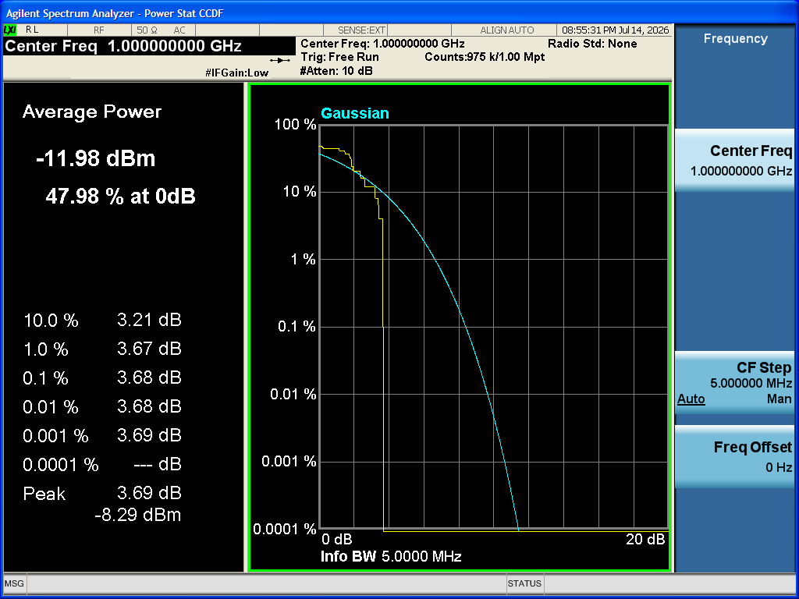 | 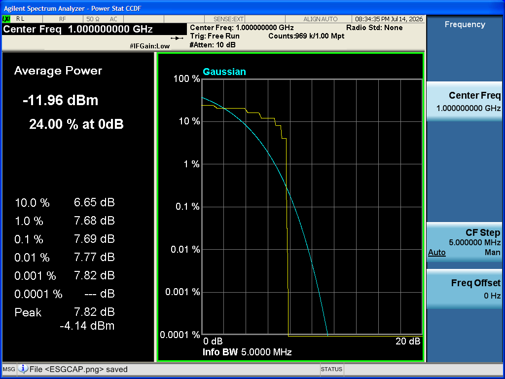 |

> 🏷️ **E4406A images coming soon** — the analyzer captures here are from a Keysight N9010A.

- **Equal** phasing produces a noticeably **higher PAPR** — all 8 tones add up in phase, so the peak
  approaches **10·log₁₀(8) ≈ 9 dB** above average. The CCDF curve for Equal sits further to the right
  (higher crest values are more probable).
- **Newman** packs the same 8 tones with smaller peaks — typically **~5–6 dB PAPR**, CCDF curve shifted
  left.
- On **Spectrum**, the same set of equally-spaced tones in both cases (phasing changes peaks, not the
  tone amplitudes/positions).

**Tips / troubleshooting:**
- Try **Random** phasing too — it usually lands between Newman and Equal.
- Multitone is a classic test for amplifier linearity and PAPR handling; high-PAPR (Equal) signals
  stress amplifiers and DAC headroom hardest.
- If you Download/Play this, watch **Notifications** for any **DAC over-range** warning on the
  high-PAPR case (see Tutorial 9 and UserGuide §8).

---

## Tutorial 4 — Band-limited noise (AWGN)

**Goal:** Generate band-limited additive white Gaussian noise and see its characteristically high
crest factor on the **CCDF** view and the readout, and learn what clipping does.

**You'll learn:**
- How to configure the **AWGN** personality (noise bandwidth, C/N, peak clipping).
- Why AWGN is a good headroom / CCDF test.
- How clipping trades crest factor against fidelity.

**Prerequisites:** Tutorial 1.

**Steps:**
1. Select **Source**, choose **AWGN** in the picker (see UserGuide §5.5).
2. Set **noise bandwidth = 5 000 000 Hz** (5 MHz), **carrier-to-noise ratio (C/N) = 20 dB**, and leave
   **peak clipping** off for now.
3. Click **Calculate**. Set one plot pane to **CCDF** and note the **PAPR** / crest figure in the
   readout.
4. Now enable **peak clipping** (try a **clip level of ~6 dB** above average) and **Calculate** again.
   Compare the CCDF curve and PAPR.

**What you should see on the analyzer** (real N9010A captures):

| AWGN spectrum (flat noise) | AWGN CCDF (~10 dB crest) |
|---|---|
|  | 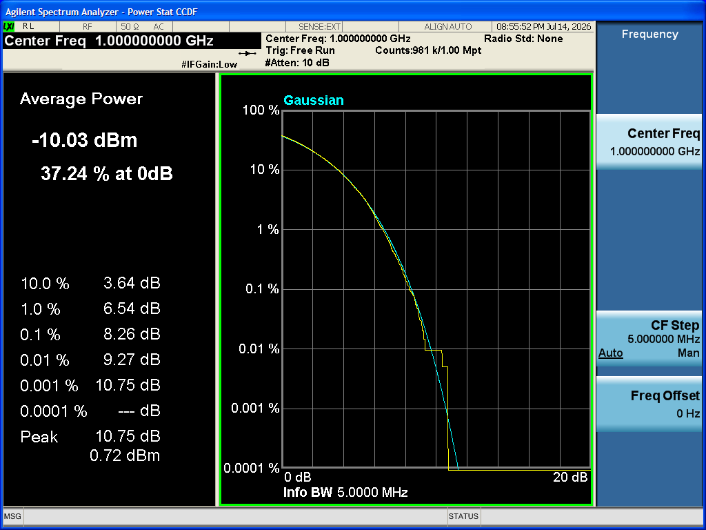 |

> 🏷️ **E4406A images coming soon** — the analyzer captures here are from a Keysight N9010A.

- A **high crest factor** for unclipped AWGN (on the order of ~10 dB) — much higher than CW or
  Newman multitone. The **CCDF** curve extends well to the right.
- With **peak clipping** on, the CCDF curve is pulled in at the high-crest tail and the PAPR drops —
  at the cost of some spectral/amplitude fidelity.
- On **Spectrum**, a roughly flat noise floor across the noise bandwidth you set.

**Tips / troubleshooting:**
- Use AWGN to sanity-check DAC headroom and runtime scaling: its broad amplitude distribution will
  trip an over-range warning sooner than deterministic signals (see Tutorial 9).
- The CCDF view is the natural home for noise-like and OFDM-like signals; keep one pane on it.

---

## Tutorial 5 — Custom digital modulation (QPSK + RRC)

**Goal:** Build a QPSK signal with root-raised-cosine pulse shaping and inspect it with the
**Constellation**, **Eye**, and **Spectrum** plot views.

**You'll learn:**
- How to configure **Custom Digital Modulation** (format, symbol rate, filter + alpha, payload).
- How constellation, eye and spectrum views reveal modulation quality and bandwidth.

**Prerequisites:** Tutorial 1.

**Steps:**
1. Select **Source**, choose **Custom Digital Modulation** in the picker (see UserGuide §5.4).
2. Set the parameters:
   - **Modulation format:** **QPSK**.
   - **Symbol rate = 1 000 000 Hz** (1 Msym/s).
   - **Pulse-shaping filter:** **RRC**, **roll-off (alpha) = 0.35** (a moderate, common value).
   - **Payload:** **PN9** (or random).
3. Click **Calculate**.
4. Set the three plot panes to **Constellation**, **Eye**, and **Spectrum** so you can see all three
   at once.

**What you should see on the analyzer** (real N9010A capture — the RRC-shaped QPSK spectrum):

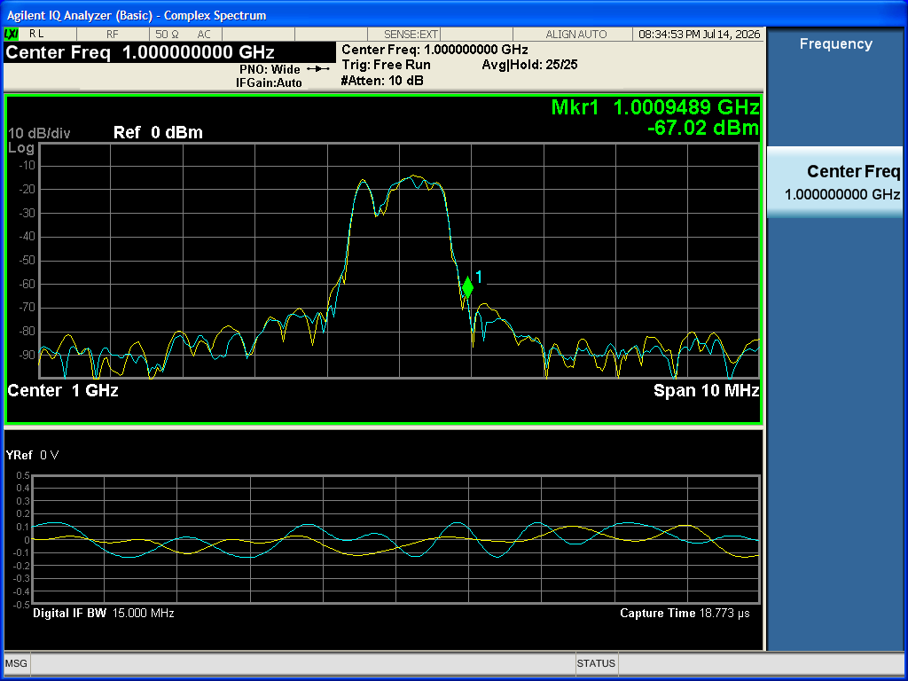

> 🏷️ **E4406A images coming soon** — the analyzer captures here are from a Keysight N9010A. The N9010A
> can't render a constellation or eye diagram (no vector-demod option), so those two below are the app's
> own plot views:

| Constellation (app view) | Eye diagram (app view) |
|---|---|
| 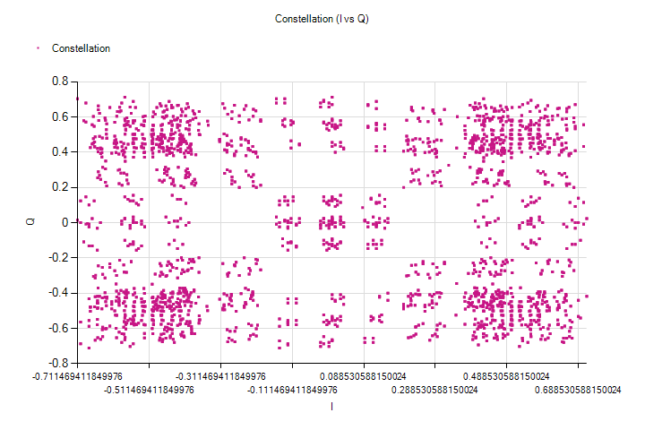 | 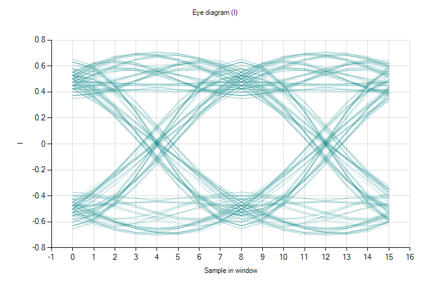 |

- **Constellation:** four QPSK clusters; with RRC shaping you'll see the trajectory between symbol
  points and tight decision points at the symbol instants.
- **Eye:** an open eye diagram — a wider opening means cleaner sampling instants; the alpha you chose
  affects the eye shape.
- **Spectrum:** a shaped main lobe whose roll-off steepness follows the **alpha** — smaller alpha →
  narrower occupied bandwidth, larger alpha → wider but gentler skirts. Cross-check the **99% occupied
  bandwidth** in the readout: for 1 Msym/s at α = 0.35 it lands near **~1.35 MHz** (≈ symbol rate ×
  (1 + α)).

**Tips / troubleshooting:**
- Try other formats (BPSK, 8PSK, 16/64/256-QAM, MSK) and watch the constellation gain points.
- Lower alpha narrows the spectrum but can close the eye; this is the classic bandwidth-vs-ISI
  trade-off.
- Custom modulation is the basis for ACP/ACPR and modulation-quality work later (Tutorial 16).

---

## Tutorial 6 — Multi-carrier signals

**Goal:** Combine several independently-placed carriers into one waveform for multi-channel /
multi-standard scenarios.

**You'll learn:**
- How the **Multi-Carrier** personality sums multiple carriers (each can be its own modulation).
- How to read a composite spectrum and its aggregate PAPR.

**Prerequisites:** Tutorials 1, 3 and 5 (so the underlying signal types are familiar).

**Steps:**
1. Select **Source**, choose **Multi-Carrier** in the picker (see UserGuide §5.3).
2. Place three carriers, each with its own modulation, for example:
   - **−5 MHz** offset — **CW** reference tone.
   - **0 Hz** offset — **QPSK**, 1 Msym/s, RRC α = 0.35 (as in Tutorial 5).
   - **+5 MHz** offset — **QPSK**, 1 Msym/s, RRC α = 0.35.
3. Click **Calculate**.
4. Inspect the **Spectrum** view (to see all carriers at their offsets) and the **CCDF** view (the
   composite often has higher PAPR than any single carrier). Note the readout PAPR and occupied
   bandwidth.

**What you should see on the analyzer** (real N9010A capture — the three carriers):


> 🏷️ **E4406A images coming soon** — the analyzer captures here are from a Keysight N9010A.

- A composite **Spectrum** with each carrier sitting at its assigned offset, each shaped by its own
  modulation.
- A **CCDF**/PAPR that reflects the summed signal — adding carriers generally raises the crest factor.

**Tips / troubleshooting:**
- Multi-carrier is ideal for multi-channel / multi-standard test scenarios.
- Watch **Notifications** for memory-cap and over-range findings; wide, multi-carrier signals consume
  more sample memory and headroom (see Tutorial 9).

---

## Tutorial 7 — Import an I/Q file

**Goal:** Replay an externally-captured or externally-generated waveform by importing its I/Q from a
file, with optional resampling to the target sample clock.

**You'll learn:**
- How to configure the **Import I/Q** personality (file path, format, source sample rate, resample).
- How resampling reconciles a foreign sample rate with the target sample clock.

**Prerequisites:** Tutorial 1, and an I/Q file you supply (CSV, interleaved Int16, or Float32).

**Steps:**
1. Select **Source**, choose **Import I/Q** in the picker (see UserGuide §5.6).
2. Set the **file path** to your I/Q file (you supply it).
3. Choose the **format** that matches your file — these are file-specific, so use *your* file's values.
   For a worked example, assume a **Float32** interleaved-I/Q capture.
4. Enter the source **sample rate (Hz)** of the captured data — e.g. **30 720 000 Hz** (30.72 MHz, a
   common LTE capture rate). Use the real rate of your file.
5. Decide whether to **resample** to the target sample clock — turn it **on** when the source rate
   (e.g. 30.72 MHz) differs from the sample clock you intend to play at (e.g. 10 MHz).
6. Click **Calculate**.

**What you should see on the analyzer** (the imported CW round-trip, played and captured on the N9010A):


> 🏷️ **E4406A images coming soon** — analyzer captures here are from a Keysight N9010A.

- The imported waveform on **I/Q vs time** and **Spectrum**, matching what your file contains.
- A readout sample count/duration consistent with your file (and the resampled rate if you enabled
  resampling).

**Tips / troubleshooting:**
- If the signal looks garbled, you almost certainly chose the wrong **format** (e.g. Int16 vs Float32)
  or the wrong source **sample rate** — fix those first.
- If the spectrum is scaled/shifted unexpectedly, check whether **resample** should be on (mismatched
  source vs target rate) and re-Calculate.
- Imported waveforms still go through validation; long captures may hit the memory cap (Tutorial 9).

---

## Part D — Impairments & validation

## Tutorial 8 — Applying impairments (I/Q imbalance, then CFR)

**Goal:** Apply optional impairments to a calculated waveform — first an **I/Q gain imbalance** to
produce a visible image tone, then **CFR** to pull PAPR back down — and compare before/after.

**You'll learn:**
- How the **Impairments** view layers independently-toggled effects on top of the source (see
  UserGuide §6).
- That a gain imbalance produces a measurable image tone.
- That CFR (crest-factor reduction) lowers PAPR.

**Prerequisites:** Tutorial 1. A multitone or modulated source (Tutorial 3 or 5) is a good carrier
for the effect.

**Steps:**
1. Build and **Calculate** a clean source (e.g. the Newman multitone from Tutorial 3). Note its PAPR
   and spectrum as a baseline.
2. Select the **Impairments** node. Enable **I/Q impairments** (its checkbox) and in its property grid
   set **gain imbalance = 3 dB** (large enough to see the image clearly). Leave the others off.
3. Click **Calculate** again (impairments are applied during Calculate, after the source produces its
   baseband I/Q — see UserGuide §6).
4. Compare the **Spectrum** to the baseline: the gain imbalance creates an **image tone** (a mirrored
   component) that wasn't there before.
5. Now enable **CFR (crest-factor reduction)** in the Impairments view and **Calculate** once more.
6. Compare the **PAPR** in the readout and the **CCDF** view before vs after CFR.

**What you should see on the analyzer** (real N9010A captures — the image tone appears at −1 MHz after
the imbalance):

| Clean tone (baseline) | 3 dB I/Q gain imbalance → image tone |
|---|---|
|  | 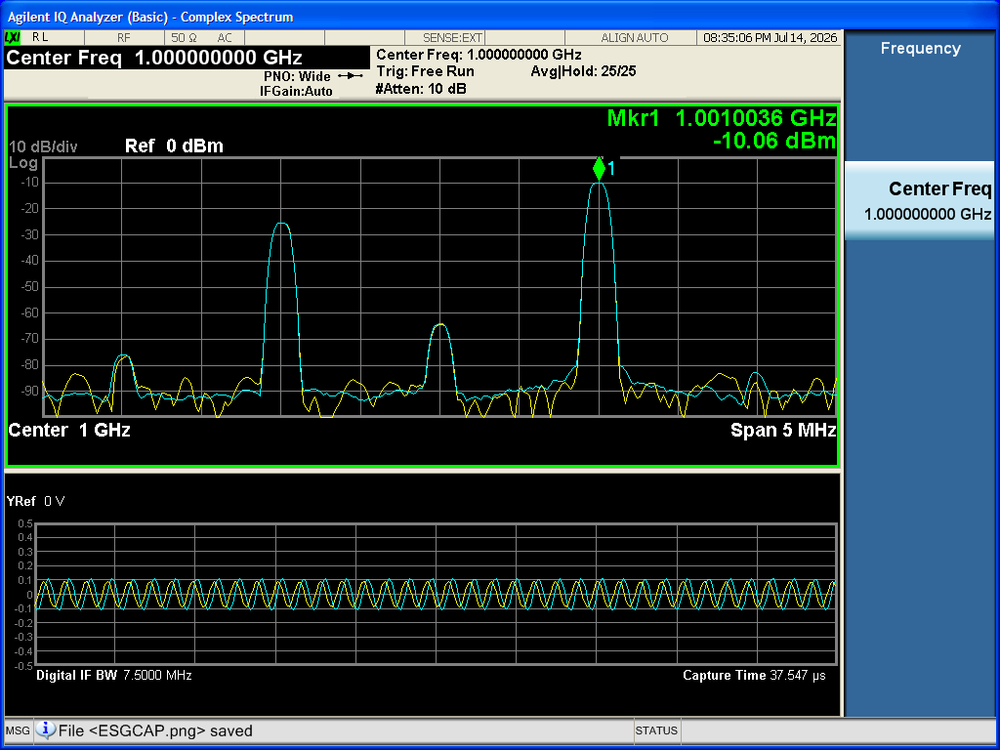 |

> 🏷️ **E4406A images coming soon** — the analyzer captures here are from a Keysight N9010A.

- After the gain imbalance: an **image tone** appears on the **Spectrum** (mirror of the wanted
  component about the carrier).
- After CFR: the **PAPR drops** and the **CCDF** high-crest tail is pulled in.

**Tips / troubleshooting:**
- Impairments are applied **in order** during Calculate; toggle them independently to isolate each
  effect.
- The gain-imbalance image is exactly what the verification battery later measures as a "gain-imbalance
  image" — keep this signal for Tutorial 15/16.
- CFR trades peak reduction for some spectral regrowth; check the spectrum skirts as well as the PAPR.

---

## Tutorial 9 — Reading and fixing validation findings

**Goal:** Deliberately trip a validation finding, read it in the **Notifications** view, and resolve
it — so you understand the safety gate that protects every hardware action.

**You'll learn:**
- What the **dependency checker** checks after every Calculate (see UserGuide §8).
- How to read finding severities (Info / Warning / Error) in **Notifications**.
- How to resolve common findings: too few samples, memory cap, DAC over-range, loop seam.

**Prerequisites:** Tutorial 1.

**Steps:**
1. Pick a way to trip a finding, then **Calculate** and read **Notifications**:
   - **Too few samples / granularity:** make the waveform very short (set length to far below the
     ARB minimum, ≈60 samples). Expect a **minimum-samples / granularity** finding.
   - **Memory cap:** make the waveform very long (long duration, high sample clock, or a long
     imported file). Expect a **memory cap** finding if it won't fit the baseband option's sample
     memory.
   - **DAC over-range:** use a high-PAPR signal (Equal-phased multitone or unclipped AWGN) and/or
     raise runtime scaling so samples would clip. Expect a **DAC over-range** finding.
   - **Loop seam:** choose a non-integer-cycle length so the waveform end doesn't line up with its
     start. Expect a **loop-seam** warning.
2. Select the **Notifications** node and read the finding — note its **severity** and the limit it
   names.
3. Resolve it:
   - **Min samples / granularity:** increase the length to meet the minimum and granularity.
   - **Memory cap:** shorten the waveform, lower the sample clock, or reduce the imported length.
   - **Over-range:** lower runtime scaling / amplitude, or apply **CFR** (Tutorial 8) to cut PAPR.
   - **Loop seam:** choose an integer-cycle length so it loops cleanly.
4. **Calculate** again and confirm the finding clears (or drops to Info).

**What you should see** (the **Notifications** dock in the app):

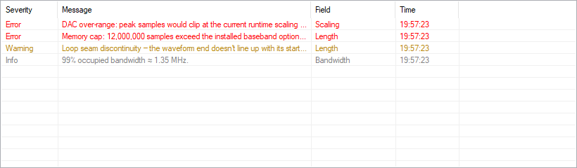

- The offending finding in **Notifications** with the right severity, naming the limit.
- After your fix and a re-Calculate, the **Error** clears. With no hard errors standing, **Download**
  / **Play** become available again.

**Tips / troubleshooting:**
- **Errors must be resolved before downloading.** The verification path *and* the assistant both
  re-run this checker as a pre-execution gate and will **refuse** a hardware action while a hard error
  stands — even if otherwise approved (see UserGuide §8 and §10.3).
- A **loop seam** is a warning, not an error — fine for a quick look, but integer-cycle lengths loop
  cleanly for clean playback.

---

## Part E — Projects, sequencing & console

## Tutorial 10 — Projects and exports

**Goal:** Save and reopen your work as a `.ssproj` project, export the waveform in different formats,
and start from a test-model preset.

**You'll learn:**
- How **Save…** / **Open…** persist the active source + settings (see UserGuide §11).
- How to export the waveform as **CSV**, a **SCPI** script, or raw **ARB** bytes.
- How to start from a built-in **test-model preset**.

**Prerequisites:** Tutorial 1 (have a calculated waveform you want to keep).

**Steps:**
1. With a configured, calculated source, click **Save…** and store the project as a `*.ssproj` file
   (JSON containing the active source + settings).
2. Change something (e.g. switch personality), then click **Open…** and reload your saved `.ssproj`
   to confirm it restores the source and settings.
3. Export the waveform in the format you need (see UserGuide §11):
   - **CSV** — for analysis in another tool.
   - **SCPI** script — the command sequence to reproduce the download.
   - raw **ARB** bytes — the encoded block as written to the instrument.
4. Try a built-in **test-model preset** as a starting point, then Calculate from it.

**What you should see:**
- A `.ssproj` file on disk that round-trips: reopening it reproduces your source and settings.
- Export files in the chosen format whose contents match the calculated waveform.

**Tips / troubleshooting:**
- Projects are plain JSON, so they're easy to diff and version-control.
- The **API key for the assistant is never written to projects** (see UserGuide §10.3) — projects
  hold signal/instrument state only.
- Exports are a great way to hand a waveform to a colleague or a CI script without sharing the whole
  project.

---

## Tutorial 11 — Sequencing multiple segments

**Goal:** Assemble several waveform segments into a sequence and play it as one.

**You'll learn:**
- How the **Sequence** view builds multi-segment playback (table + script views, subsequences,
  batch compile — see UserGuide §11).
- How markers fit in for triggering/segmentation.

**Prerequisites:** Tutorials 1–2 (to play). Have one or more calculated waveforms / projects ready to
use as segments.

**Steps:**
1. Select the **Sequence** node.
2. Add waveform **segments** to the sequence (use the table view; the script view shows the
   equivalent definition). Add more than one so you have a real sequence.
3. Optionally use **subsequences** and **batch compile** to build the whole thing at once.
4. Connect (Tutorial 2) if you want to run it on hardware, then **Download** and **Play** the
   sequence. Use **Stop** to end it.

**What you should see** (the **Sequence** table in the app):

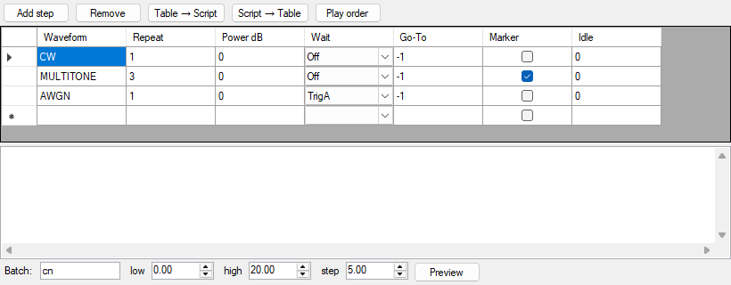

- A sequence definition listing your segments in the table/script views.
- When played, the segments run in order; the **play-state indicator** tracks the run.

**Tips / troubleshooting:**
- **ARB markers** are supported for triggering/segmentation — use them when downstream equipment needs
  a sync pulse at segment boundaries (see UserGuide §11).
- Each segment is still subject to validation; resolve any Notifications findings (Tutorial 9) before
  downloading the sequence.

---

## Tutorial 12 — Using the SCPI console

**Goal:** Send a raw SCPI query to the connected instrument and read the timestamped request/response
log.

**You'll learn:**
- How the **SCPI console** sends ad-hoc commands and logs them (see UserGuide §12).
- How to verify identity and debug the bus directly.

**Prerequisites:** A connected instrument (Tutorial 2).

**Steps:**
1. Connect to the instrument (Tutorial 2).
2. Select the **SCPI console** node.
3. Type a query — start with `*IDN?` — and send it.
4. Read the **timestamped log**: it shows the request you sent and the instrument's response, each
   stamped with a time.
5. Try a couple more (e.g. `*OPT?` to list installed options).

**What you should see** (the **SCPI console** log in the app):

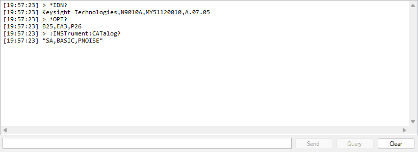

- The `*IDN?` response (manufacturer, model, serial, firmware) appears in the log against your
  request, with timestamps.

**Tips / troubleshooting:**
- The console is the manual escape hatch for ad-hoc commands and debugging. The assistant's equivalent
  (`send_raw_scpi`) is **gated and always confirmed** (Tutorial 19; UserGuide §10).
- Treat raw SCPI as the advanced, fully-logged path — it can do anything the instrument allows
  (UserGuide §15).
- Use it for discovery and connection troubleshooting when **Connect…** can't find a resource.

---

## Part F — VSA verification (E4406A / N9010A)

> These tutorials use **the analyzer** / **VSA** to mean whichever model you select with the **VSA
> model** toggle — an Agilent **E4406A** or a Keysight **N9010A (EXA)**. The steps are the same for
> both; only the addressing and the default input-damage limit differ (called out where relevant).

> 📋 **For a fully explicit bench walkthrough** — every UI control, every value, and the exact reading
> to expect on the analyzer for each signal, plus a standalone **VSA settings checklist** — see the
> [**Manual Verification Procedure**](ManualVerification.md). The tutorials below teach the workflow;
> that document is the copy-the-numbers reference.

> 📸 **Screenshots:** you can capture the analyzer's result screens over VISA automatically —
> `ESG-SignalCreator.HilHarness.exe --install-verify --capture-dir docs/images/vsa` drives CW/AM/FM/I-Q,
> measures each, and captures a screenshot per signal in one command (plus an `index.md`). For a one-off
> shot use `--capture-screen <file>`. See the README → Hardware-in-the-loop testing and the Manual
> Verification doc; captured images live under `docs/images/vsa/`.

### What each signal looks like on the analyzer

These are **real captures from an N9010A** (FW A.07.05), grabbed automatically with
`--install-verify --capture-dir` — the Power Stat CCDF view showing Average Power and the Peak/PAPR
reading for each signal in the verification battery:

| CW — tone, PAPR ≈ 0 dB | AM — 50% at 100 kHz, PAPR ≈ 3 dB |
|---|---|
|  |  |

| FM — 500 kHz dev, PAPR ≈ 0 dB | I/Q multitone — 4-tone Newman, PAPR ≈ 3 dB |
|---|---|
|  |  |

> 🏷️ **E4406A images coming soon.** The captures above are from a Keysight N9010A. Equivalent Agilent
> E4406A screenshots will be added once captured on that analyzer (the same
> `--install-verify --capture-dir` command produces them).

## Tutorial 13 — Connect the VSA safely

**Goal:** Choose the analyzer model, connect it, and arm the RF-path safety so the app blocks any
power that could damage the analyzer input.

**You'll learn:**
- How the **VSA model** toggle selects E4406A vs N9010A, and how **Connect VSA…** opens the VSA
  connection form with RF-path safety settings (see UserGuide §9).
- What **Armed**, **Analyzer max safe input**, and **Path loss** do, and how the **damage gate**
  works.

**Prerequisites:** A VSA (E4406A or N9010A) on the generator's RF output, an installed VISA runtime,
and its VISA resource (E4406A e.g. `GPIB0::17::INSTR`; N9010A e.g. `TCPIP0::<ip>::hislip0::INSTR`).
A connected ESG (Tutorial 2) is helpful.

**Steps:**
1. Make sure the analyzer is physically on the ESG's RF output (the analyzer only ever **receives**
   RF — UserGuide §9).
2. Set the **VSA model** toggle (next to **Connect VSA…**) to your analyzer — **E4406A** or
   **N9010A**. The choice is remembered between sessions and sets the connect dialog's defaults.
3. Click **Connect VSA…** to open the VSA connection form. Enter the analyzer's VISA resource and
   connect (the app refuses an instrument that doesn't match the selected model).
4. In the **RF-path safety** settings:
   - Turn **Armed** on — this enables the protection now that the analyzer is on the output.
   - Set **Analyzer max safe input (dBm)** — leave the model default (**+30 dBm** for both; the N9010A's
     +30 dBm / 1 W max safe input is per its data sheet, and the E4406A type-N input is rated ≈ +35 dBm).
   - Set **Path loss (dB)** — **0** if the analyzer is cabled directly to the ESG, or the value of any
     inline pad/attenuator (e.g. **10** for a 10 dB pad).

**What you should see on the analyzer** (once connected, the N9010A shows the signal it's receiving):


> 🏷️ **E4406A images coming soon** — analyzer captures here are from a Keysight N9010A.

- The analyzer connects and reports as the selected model; the safety settings show **Armed** with
  your max safe input and path loss.
- From now on, any commanded ESG power that would exceed the safe level at the analyzer input
  (accounting for path loss) is **blocked** — this gate guards both the manual UI and the assistant.

**Tips / troubleshooting:**
- **Arm before driving power.** The whole point of the gate is to protect the analyzer; set max safe
  input + path loss first (UserGuide §15).
- If a power command is refused, the gate is doing its job — lower the level or add/declare more path
  loss.
- If the path loss is unknown, run **Path cal…** next (Tutorial 14) to capture it.

---

## Tutorial 14 — Path calibration

**Goal:** Run the path-calibration wizard so the app knows the real cable loss between the ESG and the
analyzer, and applies it everywhere.

**You'll learn:**
- How **Path cal…** captures path loss (see UserGuide §9.3).
- Where the captured loss is applied (safety gate and Verify).

**Prerequisites:** A connected ESG (Tutorial 2) and a connected, armed VSA (Tutorial 13).

**Steps:**
1. Click **Path cal…** to open the path-calibration wizard.
2. Let it drive a clean unmodulated carrier at a known level and measure it on the analyzer. It
   records *commanded − measured* as the inline **path loss**.
3. Finish the wizard. RF is returned **off** when done.

**What you should see on the analyzer** (the cal tone measured as channel power on the N9010A):


> 🏷️ **E4406A images coming soon** — analyzer captures here are from a Keysight N9010A.

- A captured **path loss (dB)** value, now applied to both the **safety gate** and **Verify** so
  subsequent runs are self-consistent.
- RF is off at the end of calibration.

**Tips / troubleshooting:**
- Run Path cal whenever you change cables/pads, or whenever **Verify** fails on power (UserGuide §14).
- Because the captured loss feeds the safety gate too, calibrating keeps the damage gate accurate as
  well as the measurements.

---

## Tutorial 15 — Closed-loop Verify

**Goal:** Use **Verify** to measure a played signal on the analyzer and read the Expected-vs-Measured
table — for a CW tone and a multitone.

> **Tip:** for a one-click end-to-end check of the whole install, use **Verify install…** instead — it
> plays a CW → AM → FM → I/Q battery and measures each on the analyzer (UserGuide §9.7).

**You'll learn:**
- How **Verify** turns generate → measure → compare into a pass/fail table (see UserGuide §9.2).
- How to read channel power, PAPR, and tone frequency against expectations.

**Prerequisites:** Connected ESG (Tutorial 2), connected + armed VSA with path loss captured
(Tutorials 13–14).

**Concrete values used here** (matching the automated **Verify install…** and the
[Manual Verification Procedure](ManualVerification.md)): carrier **1 GHz**, commanded power **−10 dBm**,
CW tone offset **+1 MHz** (so the tone lands at **1.001 GHz**), analyzer **span 5 MHz**, path loss
**0 dB**. Tolerances: channel power **±3 dB**, PAPR **±2.5 dB**, tone frequency **±50 kHz**.

**Steps:**
1. Build and play a **CW tone** (Tutorials 1–2): **Source → CW / Single tone**, **Frequency offset =
   1 000 000 Hz**, **Amplitude = 0 dBFS**; **Instrument settings → Frequency = 1 GHz, Amplitude =
   −10 dBm**; then **Calculate → Download → Play**.
2. Click **Verify**. The app measures the played signal and populates the **Verification** view.
3. Read the Expected-vs-Measured table: each row shows the **metric**, **expected**, **measured**, the
   **Δ**, the **tolerance**, and **pass/fail**, plus a summary. For CW you'll see **channel power**
   (vs commanded level minus path loss), **PAPR** (vs the value computed from the generated I/Q), and
   **tone frequency** (vs carrier + offset).
4. Now switch the source to a **Multitone** (Tutorial 3) — **4 tones, 1 MHz spacing, Newman** — Calculate
   → Download → Play, and **Verify** again. Read the table — note PAPR is the interesting metric here
   (and there's no single-tone frequency row for multitone).

**What you should see (and on the analyzer front panel)** — real N9010A captures of the two verified signals:

| CW — spectrum | Multitone — CCDF (PAPR) |
|---|---|
|  |  |

> 🏷️ **E4406A images coming soon** — analyzer captures here are from a Keysight N9010A.

- For CW: **tone frequency = 1.001 GHz** (± 50 kHz), **channel power ≈ −10 dBm** (± 3 dB, minus path
  loss), **PAPR ≈ 0 dB** (± 2.5 dB) — all PASS. On the analyzer **Spectrum**: one sharp line at
  1.001 GHz.
- For multitone (Newman, 4 tones): **channel power ≈ −13 to −14 dBm** (± 3 dB — below CW by the crest),
  **PAPR ≈ 3.5–4 dB** (± 2.5 dB). On the analyzer **Spectrum**: four equally-spaced tones 1 MHz apart.

**Tips / troubleshooting:**
- **Verify fails on power:** run **Path cal…** (Tutorial 14) so path loss is captured, and check the
  tolerances in the verification profile (UserGuide §14).
- Verify re-runs the validation checker as a safety gate first; resolve any Notifications errors
  (Tutorial 9) before verifying.
- The Expected values come from the generated I/Q, so a clean Calculate is the reference for the
  comparison.

---

## Tutorial 16 — Analyzer measurements, mode and reference

**Goal:** Pick the analyzer measurement mode, lock a common 10 MHz reference for clean frequency
comparisons, and understand the Basic-mode measurements the app uses.

**You'll learn:**
- How **VSA Mode** lists and selects the modes actually installed (see UserGuide §9.5).
- How **Reference** locks the instruments to independent or common 10 MHz timebases (UserGuide §9.4).
- What Basic-mode measurements underpin Verify (UserGuide §9.6).

**Prerequisites:** Connected ESG and VSA (Tutorials 2, 13).

**Steps:**
1. Click **VSA Mode**. The menu lists the modes the unit actually has (read live from
   `:INSTrument:CATalog?`): always **Basic**, plus any installed standard personalities (GSM, EDGE,
   cdmaOne, cdma2000, 1xEV-DO, W-CDMA, NADC, PDC, iDEN). Select **Basic** for the closed-loop work.
2. Click **Reference**. Choose **independent** internal timebases, or a **common 10 MHz external**
   reference (a house reference, or the ESG's 10 MHz OUT cabled to the analyzer). It reports the
   resulting source for each instrument.
3. With Basic mode and (ideally) a common reference, repeat a **Verify** (Tutorial 15) and note the
   tighter frequency agreement.

**What you should see on the analyzer** — the app's typed measurements, each a real N9010A capture of the
same QPSK carrier:

| Spectrum marker | Channel power |
|---|---|
|  | 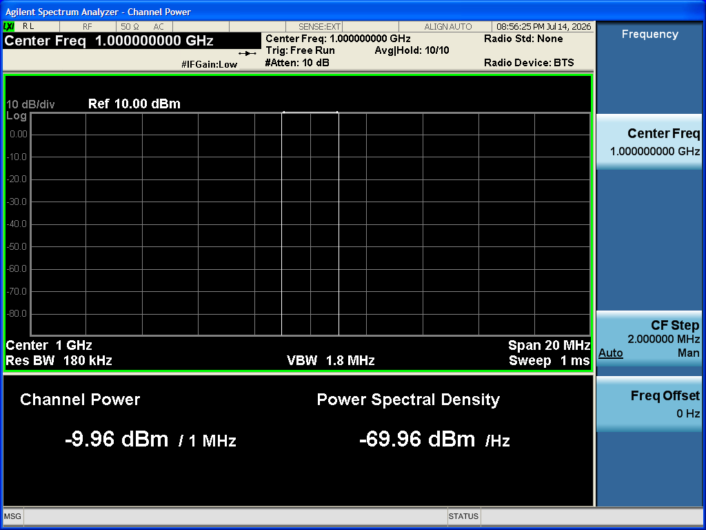 |

| ACP / ACPR | CCDF / PAPR |
|---|---|
| 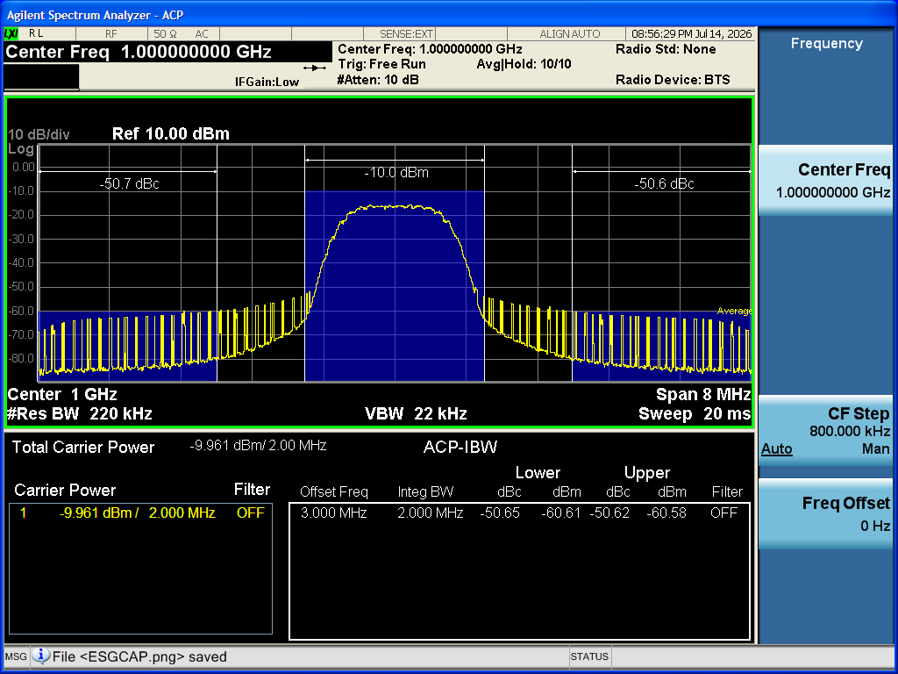 | 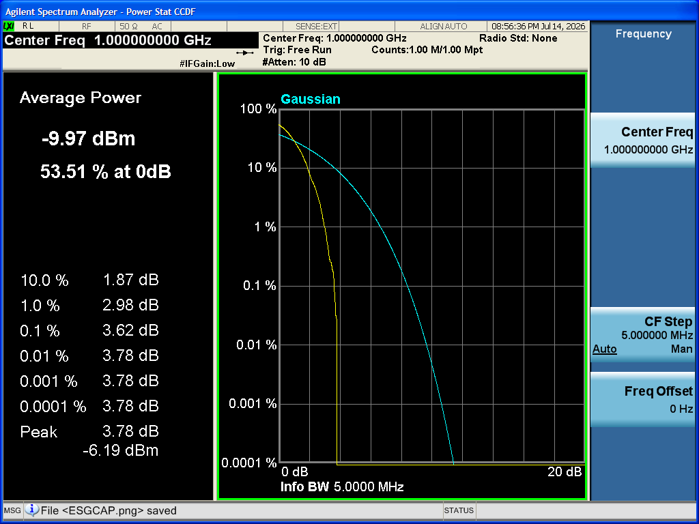 |

> 🏷️ **E4406A images coming soon** — analyzer captures here are from a Keysight N9010A.

- The **VSA Mode** menu reflects exactly what's installed on your unit.
- The **Reference** menu reports each instrument's timebase source after you choose; with a common
  10 MHz, frequency metrics in Verify agree more tightly.

**Tips / troubleshooting:**
- The app's typed Basic-mode measurements — **Channel Power**, **ACP/ACPR**, **CCDF / PAPR**,
  **Spectrum** marker (tone frequency/power, occupied BW), **Waveform** (peak/mean/peak-to-mean), and
  **Power-vs-Time** with a configurable **power mask** — back the Verify table and are also available
  to the assistant (Tutorial 18–19; UserGuide §9.6, §10.2).
- Use **ACP/ACPR** when verifying a modulated carrier (Tutorial 5), and the **Power-vs-Time** mask for
  bursted signals.
- A common 10 MHz reference is the cleanest setup for frequency comparisons; independent timebases are
  fine for power/PAPR work.

---

## Part G — The Claude assistant

## Tutorial 17 — Turn on the Claude assistant

**Goal:** Enable the in-app Claude assistant, set your API key, and ask a safe read-only question.

**You'll learn:**
- How to enable the assistant and store the API key (see UserGuide §10, §10.1).
- That read tools run freely while hardware needs confirmation.

**Prerequisites:** Tutorial 1. An Anthropic API key. (No hardware needed for this one.)

**Steps:**
1. Select the **Assistant** node. The pane has a **transcript**, an **input box** with **Send** /
   **Stop**, and a **settings strip** (**Enable assistant**, **Auto-approve hardware**, **Allow raw
   SCPI**, **Set API key…**).
2. Tick **Enable assistant** (the master switch — the feature is off until you enable it).
3. Click **Set API key…** and paste your key. (It's stored **encrypted with Windows DPAPI**, per-user,
   and never written to projects, logs, or the request body — UserGuide §10.3.)
4. In the input box, ask a read-only question, e.g. *"What's the app state?"*, and **Send**.

**What you should see** (the **Assistant** pane in the app):

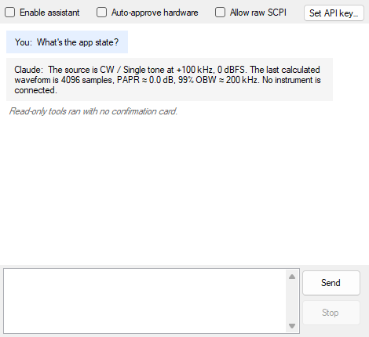

- A streamed reply describing the current app state (using read tools such as `get_app_state` /
  `get_current_config` / `get_results_readout`). **No confirmation card appears** — read tools run
  with no prompt.

**Tips / troubleshooting:**
- **"Assistant disabled / no key":** tick **Enable assistant** and **Set API key…** (UserGuide §14).
- **Stop** cancels an in-flight turn if a reply runs long.
- Reads issued in one turn run **concurrently**; the assistant won't act on instructions hidden in
  tool output (instruction-source boundary, UserGuide §10.3).

---

## Tutorial 18 — Build a signal by chat

**Goal:** Have the assistant pick a personality, configure it, and calculate a waveform — using its
configure tools, with no hardware involved.

**You'll learn:**
- How the assistant uses **configure** tools (PC/project state only) — they run without confirmation.
- How to drive the whole offline build by natural language.

**Prerequisites:** Tutorial 17 (assistant enabled with a key).

**Steps:**
1. In the **Assistant** pane, ask for a concrete signal, e.g. *"Set the source to a 4-tone multitone
   with Newman phasing, then calculate it."*
2. Watch the assistant call configure tools — e.g. `set_source_personality`, `configure_multitone`,
   then `calculate_waveform` (see UserGuide §10.2). These touch only PC/project state, so they run
   **without a confirmation card**.
3. After it calculates, ask it to *"read the results readout"* and confirm the PAPR/occupied BW match
   what you'd expect.
4. Optionally ask it to *"show the CCDF plot"* — it can call `select_plot_view`.

**What you should see** (the **Assistant** pane driving the build):

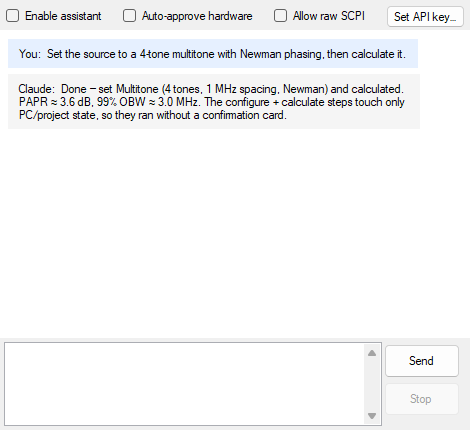

- The **Source** view updates to multitone with your settings, the plots and **readout** refresh after
  its `calculate_waveform`, and the assistant reports the readout back — all with **no Approve/Decline
  cards**, because nothing touched the instrument.

**Tips / troubleshooting:**
- Configure/calculate steps stay **serialized** in order, so the build is deterministic.
- If you ask for something that would touch hardware, you'll get a confirmation card instead — that's
  the next tutorial.
- The assistant uses the *same* operations you do; cross-check its work in the Source view and readout.

---

## Tutorial 19 — Let the assistant touch hardware

**Goal:** Let the assistant download and play a waveform (approving the inline cards), then run
`verify_signal` — and understand the auto-approve and raw-SCPI options.

**You'll learn:**
- How **inline confirmation cards** gate hardware tools (see UserGuide §10.1, §10.3).
- What **Auto-approve hardware** does — and which tools *always* confirm regardless.
- The opt-in **Allow raw SCPI** escape hatch.

**Prerequisites:** Tutorials 17–18, a connected ESG (and a connected + armed VSA for the verify
step, Tutorials 2, 13–15).

**Steps:**
1. With a calculated waveform (Tutorial 18), ask the assistant to *"download the waveform and play
   it."*
2. An **inline confirmation card** appears for each hardware action (e.g. `download_waveform`, then
   `play_rf`) showing the action and its parameters. Click **Approve** to proceed (or **Decline** to
   stop).
3. Watch the **play-state indicator** reach **Playing**, exactly as in Tutorial 2.
4. Ask the assistant to *"verify the signal."* It calls `verify_signal` (a measure/verify tool) and
   reports channel power, PAPR, and tone frequency against expectations — the same result as the
   **Verification** view (Tutorial 15).
5. Explore the settings strip:
   - **Auto-approve hardware** can skip the prompt for *ordinary* hardware tools — but **`play_rf`,
     `connect_instrument`, and `send_raw_scpi` always confirm** (RF emission, bus takeover, raw
     commands).
   - **Allow raw SCPI** enables the gated `send_raw_scpi` escape hatch (off by default, always
     confirmed per call). Only turn it on if you need ad-hoc commands.

**What you should see on the analyzer** (the assistant plays a multitone — captured on the N9010A):


> 🏷️ **E4406A images coming soon** — analyzer captures here are from a Keysight N9010A.

And in the app — the assistant's inline **Approve/Decline** confirmation card gating each hardware step:

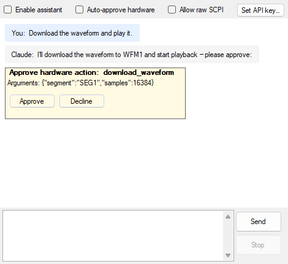

- Approve/Decline cards for the hardware steps; after approval, the download happens, RF turns on, and
  the play-state indicator shows **Playing**.
- `verify_signal` returns a pass/fail comparison matching the Verification view.

**Tips / troubleshooting:**
- **The assistant won't touch hardware without approval — by design.** Approve the card (UserGuide
  §14).
- **Refused despite approval?** A **pre-execution validation gate** re-runs the dependency checker
  before `download_waveform` / `play_rf` and **refuses on a hard validation error even if you
  approved** — fix the Notifications finding (Tutorial 9; UserGuide §10.3).
- Commanded power still goes through the **input-damage safety gate** (Tutorial 13) — the assistant
  can't drive an unsafe level into the analyzer.

---

## Part H — Automation & packaging

## Tutorial 20 — Headless hardware-in-the-loop

**Goal:** Run the headless **HilHarness** CLI for automated bench/CI tests — first ESG-only, then a
closed-loop battery with a JSON report.

**You'll learn:**
- How to run `ESG-SignalCreator.HilHarness.exe` in ESG-only and closed-loop modes (see UserGuide §13).
- That the harness enforces the safety gate and can emit a machine-readable report.

**Prerequisites:** A built `ESG-SignalCreator.HilHarness.exe`, an installed VISA runtime, a real
E4438C (and a VSA — E4406A or N9010A — on its RF output for the closed-loop run). This is a console
tool, separate from the GUI.

**Steps:**
1. **ESG-only** — connect, run `*IDN?`/`*OPT?`, download a CW, arm the ARB, and read back (RF stays
   off / safe):
   ```powershell
   ESG-SignalCreator.HilHarness.exe "TCPIP0::192.168.1.82::inst1::INSTR"
   ```
2. **Closed-loop battery** — verify every signal type on the analyzer across a frequency sweep, with a
   JSON report:
   ```powershell
   ESG-SignalCreator.HilHarness.exe --vsa GPIB0::17::INSTR --all --dwell-seconds 3 --json report.json
   # For a Keysight N9010A instead (LAN address + model flag):
   ESG-SignalCreator.HilHarness.exe --vsa TCPIP0::192.168.1.90::hislip0::INSTR --vsa-model n9010a --all
   ```
   `--vsa-model` (`e4406a` default | `n9010a`) selects the analyzer, its identity guard, and its
   per-model input-damage default.
4. **Install self-test** — run the CW → AM → FM → I/Q battery (the headless twin of the in-app
   **Verify install…**, UserGuide §9.7) on the one selected analyzer, with a JSON report + exit code:
   ```powershell
   ESG-SignalCreator.HilHarness.exe --install-verify --vsa GPIB0::17::INSTR --vsa-model e4406a --json verify.json
   ```
   It targets a single analyzer per run (`--vsa-model`); to cover both, run it twice.
3. Or run a single signal type, or the amplitude-flatness power sweep:
   ```powershell
   ESG-SignalCreator.HilHarness.exe --vsa --signal multitone
   ESG-SignalCreator.HilHarness.exe --vsa --flatness
   ```
4. Open `report.json` and review the per-step PASS/FAIL results.

**What you should see on the analyzer** (the closed-loop run measures each signal — e.g. channel power on
the N9010A):


> 🏷️ **E4406A images coming soon** — analyzer captures here are from a Keysight N9010A.

- ESG-only: identity/options, a CW downloaded to **WFM1**, the ARB armed, and frequency/amplitude read
  back — RF off and safe.
- Closed-loop: each signal type driven at a safe level across the sweep and verified on the analyzer,
  with per-step PASS/FAIL, a non-zero exit code on failure, and a machine-readable `report.json`.

**Tips / troubleshooting:**
- The harness **enforces the input-damage safety gate** (per-model default — +30 dBm for both models)
  and keeps the analyzer sweeping during dwell so the front panel tracks live; it ends RF-off.
- It exits **non-zero on failure** — ideal as a CI gate.
- Use the sweep options (`--points`, `--start-hz`, `--stop-hz`, `--carrier-hz`, `--offset-hz`,
  `--verify-power-dbm`, `--max-input-dbm`, `--path-loss-db`, `--dwell-seconds`, `--json`) to tailor
  the run (see README → Hardware-in-the-loop testing).

---

## Tutorial 21 — Build and install the MSI

**Goal:** Build the Windows installer and understand what it installs.

**You'll learn:**
- How to build the MSI with `build-installer.ps1`.
- What the installer does (briefly).

**Prerequisites:** A Windows build environment with `dotnet`/MSBuild. (WiX Toolset v5 is restored from
NuGet automatically — no toolset install needed.)

**Steps:**
1. From the repo root, build the installer:
   ```powershell
   ./build-installer.ps1 -Version 1.0.0.0
   ```
2. When it finishes, locate the produced MSI and run it to install.

**What you should see:**
- An MSI that installs the app **per-machine** to `Program Files`, adds **Start-menu / desktop
  shortcuts** and a proper **Add/Remove-Programs** entry, **requires .NET Framework 4.7.2**, and
  **detects an installed VISA runtime** (vendor-neutral — Keysight, NI, R&S, Rigol, …). Uninstall is
  clean.

**Tips / troubleshooting:**
- Prebuilt installers are published on the project's **Releases** page; you don't have to build your
  own unless you want a custom version.
- The installer project is kept out of the solution, so a machine without WiX still builds the app.
- For full build/CI details (including the continuous-release GitHub Actions workflow), see
  [Packaging.md](Packaging.md).

---

*That's the full tour — from a first offline CW tone to closed-loop verification, assistant-driven
flows, headless automation, and a packaged installer. For the authoritative reference behind any step,
see [UserGuide.md](UserGuide.md).*
