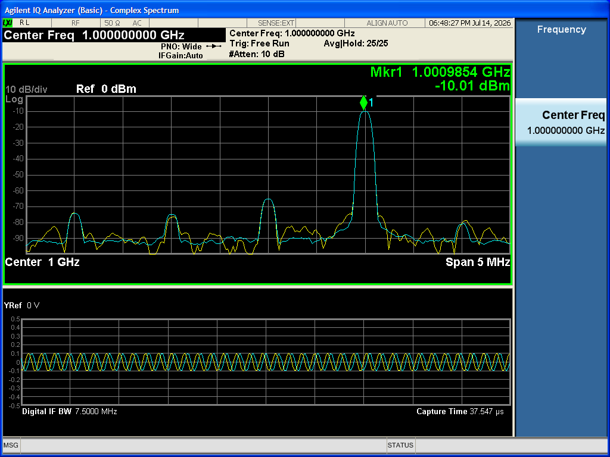
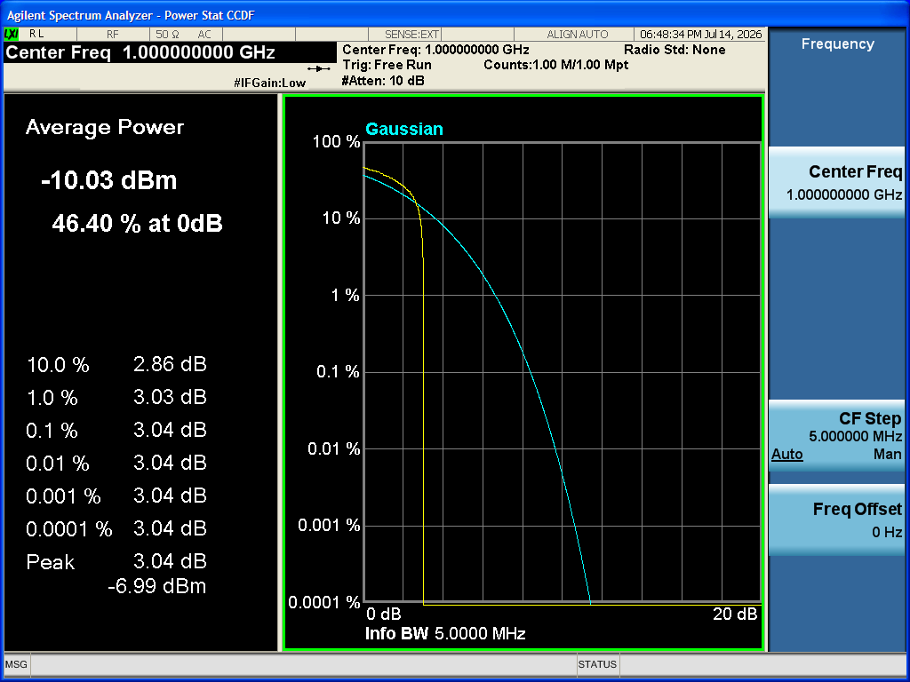
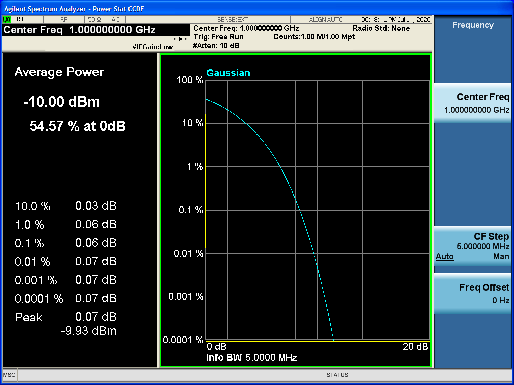

# ESG-SignalCreator — Tutorials

> 🌐 English: [Tutorials](../Tutorials.md) · **Dansk** (denne side)

Praktiske, trinvise gennemgange for **ESG-SignalCreator** (appen **ESG Signal Studio**). Hver
tutorial er en kort, selvstændig øvelse, du kan udføre ved arbejdsbænken. De starter med ting, du
kan gøre fuldstændig **offline** (ingen instrument nødvendigt), og udvikler sig derefter til at styre en rigtig **E4438C**-generator,
udforske hver signaltype, anvende impairments (signalforringelser), sekvensere og eksportere projekter,
lukke sløjfen med en **VSA** (E4406A eller N9010A), lade den indbyggede **Claude-assistent** drive flowet
og endelig automatisere og pakke appen.

Denne fil er *øvelsesledsageren* til [UserGuide.md](UserGuide.md), som er den autoritative
reference for hver funktion. Hvor end en tutorial berører en funktion, krydslinker den til det relevante
afsnit i User Guide (f.eks. "se UserGuide §5.2"). For et overblik samt build- og installationsnoter, se
[README](../../README.md).

## Sådan bruger du disse tutorials

- **Lav dem i rækkefølge.** Hver enkelt antager, at du har gennemført de tidligere, så begreber og UI-
  navigation introduceres én gang og genbruges derefter.
- **Du behøver ikke hardware for at starte.** Del A (og det meste af Del C) kører helt offline ved hjælp af
  **Calculate** og plottene. De dele af B, D–H, der berører instrumentet, er tydeligt markeret i
  **Forudsætninger**.
- **Vær sikker.** Alt, der udsender RF eller kan beskadige analysatoren, er beskyttet af en gate. Læs sikkerheds-
  noterne i [UserGuide §15](UserGuide.md#15-sikkerhedsnoter), før du driver effekt ind i analysatoren.
- **Pipelinen er bevidst.** Du **Calculate** på pc'en, **Download** til generatoren og derefter
  **Play**. Intet når DAC'en eller RF, før du siger til (se UserGuide §7).
- **Konkrete værdier er angivet — behandl dem som gennemarbejdede eksempler.** Hver tutorial angiver eksakte
  værdier, du skal indtaste i hvert felt, så du kan følge med og få de viste resultater. De er fornuftige
  standardvalg, ikke de eneste gyldige valg; når et trin virker, så ændr én værdi ad gangen for at se dens
  effekt. Hvor din builds standarder eller din hardware afviger, er appens paneler og **resultataflæsningen**
  altid den autoritative kilde.

> Gennemgående er UI-elementer navngivet præcis, som de fremstår: værktøjslinje-**knapper**, venstretræ-**noder**
> og højredok-**plotvisninger**.

## Indholdsfortegnelse

**Del A — Offline-grundbegreber**
1. [Tag rundvisningen & byg din første CW-tone offline](#tutorial-1--tag-rundvisningen--byg-din-første-cw-tone-offline)

**Del B — Styring af generatoren**
2. [Forbind til ESG'en og afspil en CW-tone](#tutorial-2--forbind-til-esgen-og-afspil-en-cw-tone)

**Del C — Signaltyper i dybden**
3. [Multitone og PAPR](#tutorial-3--multitone-og-papr)
4. [Båndbegrænset støj (AWGN)](#tutorial-4--båndbegrænset-støj-awgn)
5. [Brugerdefineret digital modulation (QPSK + RRC)](#tutorial-5--brugerdefineret-digital-modulation-qpsk--rrc)
6. [Multi-carrier-signaler](#tutorial-6--multi-carrier-signaler)
7. [Importér en I/Q-fil](#tutorial-7--importér-en-iq-fil)

**Del D — Impairments & validering**
8. [Anvendelse af impairments (I/Q-ubalance, derefter CFR)](#tutorial-8--anvendelse-af-impairments-iq-ubalance-derefter-cfr)
9. [Læsning og afhjælpning af valideringsfund](#tutorial-9--læsning-og-afhjælpning-af-valideringsfund)

**Del E — Projekter, sekvensering & konsol**
10. [Projekter og eksport](#tutorial-10--projekter-og-eksport)
11. [Sekvensering af flere segmenter](#tutorial-11--sekvensering-af-flere-segmenter)
12. [Brug af SCPI-konsollen](#tutorial-12--brug-af-scpi-konsollen)

**Del F — VSA-verifikation (E4406A / N9010A)**
13. [Forbind VSA'en sikkert](#tutorial-13--forbind-vsaen-sikkert)
14. [Stikalibrering](#tutorial-14--stikalibrering)
15. [Closed-loop Verify](#tutorial-15--closed-loop-verify)
16. [Analysatormålinger, mode og reference](#tutorial-16--analysatormålinger-mode-og-reference)

**Del G — Claude-assistenten**
17. [Slå Claude-assistenten til](#tutorial-17--slå-claude-assistenten-til)
18. [Byg et signal via chat](#tutorial-18--byg-et-signal-via-chat)
19. [Lad assistenten berøre hardware](#tutorial-19--lad-assistenten-berøre-hardware)

**Del H — Automatisering & pakning**
20. [Headless hardware-in-the-loop](#tutorial-20--headless-hardware-in-the-loop)
21. [Byg og installér MSI'en](#tutorial-21--byg-og-installér-msien)

---

## Del A — Offline-grundbegreber

## Tutorial 1 — Tag rundvisningen & byg din første CW-tone offline

**Mål:** Start appen, lær at finde rundt i skallen, og generér (offline) din første
kontinuerlige bølge-tone, så du kan aflæse resultataflæsningen og udforske plottene.

**Du lærer:**
- Skallens fire områder: værktøjslinje, venstretræ, midterkort, højre plotdok.
- Hvordan **Source**-visningen fungerer, og hvordan du konfigurerer **CW / Single tone**.
- Hvad **Calculate** gør, og hvordan du læser **resultataflæsningen** (herunder PAPR).
- Hvordan du skifter mellem **plotvisninger** og bruger rubber-band-zoom.

**Forudsætninger:** Ingen — dette er fuldstændig offline. Ingen instrument- eller VISA-runtime påkrævet.

**Trin:**
1. Start **ESG Signal Studio** (den moderne `StudioForm`-skal). Statuslinjen i bunden
   viser **Offline** og ingen forbundet model — det er forventet.
2. Tag et hurtigt kig rundt (se UserGuide §4):
   - **Øverste værktøjslinje:** **Connect…**, **Connect VSA…**, **Calculate**, **Download**, **Play**,
     **Stop**, **Verify**, **Path cal…**, **Reference**, **VSA Mode**, **Calc → DL → Play**,
     **Save…**, **Open…**.
   - **Venstretræ:** **Source**, **Impairments**, **Sequence**, **Instrument settings**,
     **SCPI console**, **Notifications**, **Verification**, **Assistant**.
   - **Højredok:** tre plotruder (hver med en visningsvælger), en **resultataflæsnings**-stribe,
     en **fremdriftslinje** og en **afspilningstilstands-indikator**.
3. Vælg noden **Source** i venstretræet. I personlighedsvælgeren skal du vælge **CW / Single
   tone** (se UserGuide §5.1).
4. I konfigurationspanelet skal du angive CW-parametrene:
   - **Frequency offset** fra bærebølgen (Hz) = **100 000** (100 kHz) — et lille offset, så tonen
     sidder synligt uden for midten på spektret. (Brug **0** for en tone på bærebølgen.)
   - **Amplitude** (dBFS) = **0** (fuld skala). Skru den ned med en negativ værdi — f.eks. **−3** — hvis du
     foretrækker headroom.
   - **Starting phase** (grader) = **0**.
5. Klik på **Calculate** på værktøjslinjen. Se **fremdriftslinjen** køre; plottene, **Notifications**
   og **resultataflæsningen** opdateres alle, når den er færdig. Ingen hardware berøres, så dette er altid
   sikkert (se UserGuide §7).
6. Læs **resultataflæsnings**-striben: samplingsantal, sample clock, varighed, downloadstørrelse (bytes),
   peak, RMS, **PAPR** og 99 % optaget båndbredde.
7. Udforsk højredokken. Hver rude har en visningsvælger — gennemløb én via **I/Q vs time**,
   **Spectrum**, **Constellation**, **CCDF** og **Eye**. Standardtrioen er **I/Q vs time /
   Spectrum / Constellation**.
8. **Rubber-band-zoom:** træk et rektangel på et hvilket som helst plot for at zoome ind på et område (zoom for eksempel
   **Spectrum**-visningen ind på tonen). Brug plottets reset-/unzoom-gestus for at vende tilbage til fuld visning.

**Hvad du bør se:**
- På **I/Q vs time**, jævne sinuskurver for I og Q.
- På **Spectrum**, en enkelt skarp linje ved det frekvensoffset, du angav.
- På **Constellation**, et enkelt punkt (eller en lille ring, hvis du angav en faserotation/-offset).
- I aflæsningen en **PAPR ≈ 0 dB** — en ren CW-tone har i praksis intet peak-to-average-forhold.

**Tips / fejlfinding:**
- Hvis plottene ser tomme ud, så sørg for, at du faktisk klikkede på **Calculate**, efter du redigerede kilden.
- Forskellige plotvisninger besvarer forskellige spørgsmål; du vil læne dig op ad **Spectrum**, **Constellation**,
  **CCDF** og **Eye** kraftigt i senere tutorials, så bliv tryg ved at skifte mellem dem nu.
- Alt her fungerer **Offline** — knapperne **Download**/**Play** er utilgængelige, indtil du
  forbinder et instrument (Tutorial 2).

---

## Del B — Styring af generatoren

## Tutorial 2 — Forbind til ESG'en og afspil en CW-tone

**Mål:** Forbind til en rigtig E4438C, indstil bærebølgen, og kør hele **Calculate → Download → Play**-
pipelinen for at udsende din CW-tone på rigtig RF — og **Stop** den derefter.

**Du lærer:**
- Hvordan du forbinder med **Connect…** ved hjælp af en VISA-resourcestreng.
- **Instrument settings**-visningen (frekvens, amplitude, RF/modulation, sample clock, skalering).
- De tre pipeline-trin og ét-kliks **Calc → DL → Play**.
- **Afspilningstilstands-indikatoren**, og hvordan du **Stop**'er RF.

**Forudsætninger:** En E4438C med en baseband/ARB-option (001/601 eller 002/602), en installeret VISA-
runtime og instrumentets VISA-resourcestreng. Du har gennemført Tutorial 1.

**Trin:**
1. Klik på **Connect…** for at åbne forbindelsesmanageren (se UserGuide §4.1). Indtast din VISA-resource,
   for eksempel `TCPIP0::192.168.1.82::inst1::INSTR` (LAN) eller `GPIB0::17::INSTR` (GPIB), eller brug
   managerens discovery/Find. Forbind.
2. Bekræft, at statuslinjen nu viser **Online** og den forbundne model; forbindelsen aflæser
   `*IDN?` / `*OPT?`.
3. Vælg noden **Instrument settings** (se UserGuide §4.2). Indstil **carrier frequency = 1 GHz**
   (`1000000000`) og **amplitude = −10 dBm** (et sikkert, lavt niveau — hæv det først senere, hvis du ved,
   at stien er sikker). Bekræft at **RF/modulation** er konfigureret, som du ønsker, og gennemgå **ARB sample
   clock** og **runtime scaling** (standardskaleringen skruer DAC'en ned — omkring 70 % — for headroom).
   Panelet aflæser værdier tilbage fra instrumentet.
4. Vælg noden **Source** igen, og behold CW-personligheden fra Tutorial 1 (eller konfigurer den på ny).
   Klik på **Calculate**.
5. Klik på **Download** for at indkode bølgeformen og skubbe den til generatorens flygtige **WFM1** ARB-
   hukommelse (se UserGuide §7). Downloadstørrelsen og målet vises i aflæsningen / Notifications.
6. Klik på **Play** for at arme ARB'en og tænde **RF on**. Se **afspilningstilstands-indikatoren** bevæge sig gennem
   sine tilstande (Idle / Busy / Waiting-for-trigger / **Playing**).
7. Når du er færdig, så klik på **Stop** for at afvæbne ARB'en og slukke **RF off**.
8. **Genvej:** i stedet for tre klik kan du trykke på **Calc → DL → Play** for at køre alle tre trin
   i rækkefølge.

**Hvad du bør se:**
- Afspilningstilstands-indikatoren når **Playing** efter **Play** og vender tilbage til Idle efter **Stop**.
- En CW-tone på en hvilken som helst analysator-/spektrummonitor på RF-udgangen, ved bærebølge + dit offset.

**Tips / fejlfinding:**
- **"Connect the ESG first" / Download eller Play nedtonet:** du har brug for både en *beregnet* bølgeform
  *og* en forbindelse. Forbind, derefter Calculate, derefter Download/Play (se UserGuide §14).
- **Åbning fejler / resource ikke fundet:** kontrollér, at VISA-runtimen er installeret, og at resourcestrengen er
  korrekt (prøv forbindelsesmanagerens Find, eller SCPI-konsollen i Tutorial 12).
- **Husk, at Play udsender RF.** Brug **Stop** for at slukke den (UserGuide §15).

---

## Del C — Signaltyper i dybden

## Tutorial 3 — Multitone og PAPR

**Mål:** Byg et multitone-signal, og lær, hvordan **fasestrategien** ændrer peak-to-average-effekt-
forholdet, ved at sammenligne **Newman** vs **Zero**-fasning i **resultataflæsningen** og **CCDF**-visningen.

**Du lærer:**
- Hvordan du konfigurerer **Multitone**-personligheden (toneantal, afstand, fasestrategi).
- Hvorfor fasning betyder noget for PAPR / forstærkerbelastning.
- Hvordan du læser PAPR fra aflæsningen og fortolker **CCDF**-plottet.

**Forudsætninger:** Tutorial 1. (Offline er fint; forbind, hvis du vil afspille det.)

**Trin:**
1. Vælg **Source**, vælg **Multitone** i vælgeren (se UserGuide §5.2).
2. Indstil **antallet af toner = 8**, **toneafstanden = 1 000 000 Hz** (1 MHz) og **fasestrategien =
   Newman** (som minimerer PAPR).
3. Klik på **Calculate**. Bemærk **PAPR**-værdien i aflæsningen. Indstil én plotrude til **CCDF**-
   visningen og observér kurven.
4. Skift kun **fasestrategien** til **Zero** (alle toner fasejusteret), og **Calculate** igen.
5. Sammenlign den nye **PAPR** i aflæsningen og den nye **CCDF**-kurve mod Newman-kørslen.

**Hvad du bør se:**
- **Zero**-fasning giver en mærkbart **højere PAPR** — alle 8 toner lægges sammen i fase, så peaken
  nærmer sig **10·log₁₀(8) ≈ 9 dB** over gennemsnittet. CCDF-kurven for Zero ligger længere til højre (højere
  crest-værdier er mere sandsynlige).
- **Newman** pakker de samme 8 toner med mindre peaks — typisk **~5–6 dB PAPR**, CCDF-kurve forskudt mod venstre.
- På **Spectrum**, det samme sæt af ligeligt fordelte toner i begge tilfælde (fasning ændrer peaks, ikke
  toneamplituderne/-positionerne).

**Tips / fejlfinding:**
- Prøv også **Random**-fasning — den lander normalt mellem Newman og Zero.
- Multitone er en klassisk test for forstærkerlinearitet og PAPR-håndtering; signaler med høj PAPR (Zero)
  belaster forstærkere og DAC-headroom hårdest.
- Hvis du Download/Play'er dette, så hold øje med **Notifications** for en eventuel **DAC over-range**-advarsel i
  tilfældet med høj PAPR (se Tutorial 9 og UserGuide §8).

---

## Tutorial 4 — Båndbegrænset støj (AWGN)

**Mål:** Generér båndbegrænset additiv hvid gaussisk støj, og se dens karakteristisk høje
crest-faktor på **CCDF**-visningen og i aflæsningen, og lær, hvad clipping gør.

**Du lærer:**
- Hvordan du konfigurerer **AWGN**-personligheden (støjbåndbredde, C/N, peak clipping).
- Hvorfor AWGN er en god headroom-/CCDF-test.
- Hvordan clipping bytter crest-faktor for fidelitet.

**Forudsætninger:** Tutorial 1.

**Trin:**
1. Vælg **Source**, vælg **AWGN** i vælgeren (se UserGuide §5.5).
2. Indstil **støjbåndbredde = 5 000 000 Hz** (5 MHz), **carrier-to-noise-forhold (C/N) = 20 dB**, og lad
   **peak clipping** være slået fra for nu.
3. Klik på **Calculate**. Indstil én plotrude til **CCDF**, og bemærk **PAPR**-/crest-tallet i
   aflæsningen.
4. Slå nu **peak clipping** til (prøv et **clip-niveau på ~6 dB** over gennemsnittet), og **Calculate** igen.
   Sammenlign CCDF-kurven og PAPR.

**Hvad du bør se:**
- En **høj crest-faktor** for uclippet AWGN (i størrelsesordenen ~10 dB) — meget højere end CW eller
  Newman-multitone. **CCDF**-kurven strækker sig langt til højre.
- Med **peak clipping** slået til trækkes CCDF-kurven ind i halen med høj crest, og PAPR falder —
  på bekostning af noget spektral/amplitude-fidelitet.
- På **Spectrum**, et nogenlunde fladt støjgulv hen over den støjbåndbredde, du angav.

**Tips / fejlfinding:**
- Brug AWGN til at sanity-tjekke DAC-headroom og runtime scaling: dens brede amplitudefordeling vil
  udløse en over-range-advarsel hurtigere end deterministiske signaler (se Tutorial 9).
- CCDF-visningen er det naturlige hjem for støjlignende og OFDM-lignende signaler; hold én rude på den.

---

## Tutorial 5 — Brugerdefineret digital modulation (QPSK + RRC)

**Mål:** Byg et QPSK-signal med root-raised-cosine-pulsformning, og inspicér det med
**Constellation**-, **Eye**- og **Spectrum**-plotvisningerne.

**Du lærer:**
- Hvordan du konfigurerer **Custom Digital Modulation** (format, symbolrate, filter + alpha, payload).
- Hvordan constellation-, eye- og spectrum-visninger afslører modulationskvalitet og båndbredde.

**Forudsætninger:** Tutorial 1.

**Trin:**
1. Vælg **Source**, vælg **Custom Digital Modulation** i vælgeren (se UserGuide §5.4).
2. Indstil parametrene:
   - **Modulationsformat:** **QPSK**.
   - **Symbolrate = 1 000 000 Hz** (1 Msym/s).
   - **Pulsformningsfilter:** **RRC**, **roll-off (alpha) = 0.35** (en moderat, almindelig værdi).
   - **Payload:** **PN9** (eller tilfældigt).
3. Klik på **Calculate**.
4. Indstil de tre plotruder til **Constellation**, **Eye** og **Spectrum**, så du kan se alle tre
   på én gang.

**Hvad du bør se:**
- **Constellation:** fire QPSK-klynger; med RRC-formning ser du trajektorien mellem symbol-
  punkter og tætte beslutningspunkter ved symbolinstanterne.
- **Eye:** et åbent øjediagram — en bredere åbning betyder renere samplingsinstanter; den alpha, du valgte,
  påvirker øjeformen.
- **Spectrum:** en formet hovedlap, hvis roll-off-stejlhed følger **alpha** — mindre alpha →
  smallere optaget båndbredde, større alpha → bredere, men blødere skirts. Krydstjek den **99 % optagne
  båndbredde** i aflæsningen: for 1 Msym/s ved α = 0.35 lander den nær **~1,35 MHz** (≈ symbolrate ×
  (1 + α)).

**Tips / fejlfinding:**
- Prøv andre formater (BPSK, 8PSK, 16/64/256-QAM, MSK), og se konstellationen vinde punkter.
- Lavere alpha indsnævrer spektret, men kan lukke øjet; dette er den klassiske afvejning mellem båndbredde og ISI.
- Brugerdefineret modulation er grundlaget for ACP/ACPR- og modulationskvalitetsarbejde senere (Tutorial 16).

---

## Tutorial 6 — Multi-carrier-signaler

**Mål:** Kombinér flere uafhængigt placerede bærebølger til én bølgeform til multi-channel-/
multi-standard-scenarier.

**Du lærer:**
- Hvordan **Multi-Carrier**-personligheden summerer flere bærebølger (hver kan have sin egen modulation).
- Hvordan du læser et sammensat spektrum og dets samlede PAPR.

**Forudsætninger:** Tutorial 1, 3 og 5 (så de underliggende signaltyper er bekendte).

**Trin:**
1. Vælg **Source**, vælg **Multi-Carrier** i vælgeren (se UserGuide §5.3).
2. Placér tre bærebølger, hver med sin egen modulation, for eksempel:
   - **−5 MHz** offset — **CW**-referencetone.
   - **0 Hz** offset — **QPSK**, 1 Msym/s, RRC α = 0.35 (som i Tutorial 5).
   - **+5 MHz** offset — **QPSK**, 1 Msym/s, RRC α = 0.35.
3. Klik på **Calculate**.
4. Inspicér **Spectrum**-visningen (for at se alle bærebølger ved deres offsets) og **CCDF**-visningen (det
   sammensatte signal har ofte højere PAPR end nogen enkelt bærebølge). Bemærk aflæsningens PAPR og optagne
   båndbredde.

**Hvad du bør se:**
- Et sammensat **Spectrum** med hver bærebølge placeret ved sit tildelte offset, hver formet af sin egen
  modulation.
- En **CCDF**/PAPR, der afspejler det summerede signal — tilføjelse af bærebølger hæver generelt crest-faktoren.

**Tips / fejlfinding:**
- Multi-carrier er ideel til multi-channel-/multi-standard-testscenarier.
- Hold øje med **Notifications** for memory-cap- og over-range-fund; brede multi-carrier-signaler forbruger
  mere samplinghukommelse og headroom (se Tutorial 9).

---

## Tutorial 7 — Importér en I/Q-fil

**Mål:** Genafspil en eksternt opfanget eller eksternt genereret bølgeform ved at importere dens I/Q fra en
fil, med valgfri resampling til mål-sample-clock.

**Du lærer:**
- Hvordan du konfigurerer **Import I/Q**-personligheden (filsti, format, kilde-samplingsrate, resample).
- Hvordan resampling forener en fremmed samplingsrate med mål-sample-clock.

**Forudsætninger:** Tutorial 1, og en I/Q-fil, du selv leverer (CSV, interleaved Int16 eller Float32).

**Trin:**
1. Vælg **Source**, vælg **Import I/Q** i vælgeren (se UserGuide §5.6).
2. Indstil **filstien** til din I/Q-fil (du leverer den).
3. Vælg det **format**, der matcher din fil — disse er filspecifikke, så brug *din* fils værdier. Som et
   gennemarbejdet eksempel antages en **Float32** interleaved-I/Q-optagelse.
4. Indtast kildens **samplingsrate (Hz)** for de opfangede data — f.eks. **30 720 000 Hz** (30,72 MHz, en
   almindelig LTE-optagelsesrate). Brug den reelle rate for din fil.
5. Beslut, om du vil **resample** til mål-sample-clock — slå det **til**, når kilderaten (f.eks. 30,72 MHz)
   afviger fra den sample clock, du har til hensigt at afspille ved (f.eks. 10 MHz).
6. Klik på **Calculate**.

**Hvad du bør se:**
- Den importerede bølgeform på **I/Q vs time** og **Spectrum**, som matcher det, din fil indeholder.
- Et aflæst samplingsantal/varighed, der er i overensstemmelse med din fil (og den resamplede rate, hvis du slog
  resampling til).

**Tips / fejlfinding:**
- Hvis signalet ser forvansket ud, har du næsten med sikkerhed valgt det forkerte **format** (f.eks. Int16 vs Float32)
  eller den forkerte kilde-**samplingsrate** — ret dem først.
- Hvis spektret er uventet skaleret/forskudt, så tjek, om **resample** bør være slået til (mismatch mellem
  kilde- og mål-rate), og Calculate igen.
- Importerede bølgeformer gennemgår stadig validering; lange optagelser kan ramme memory-cap'en (Tutorial 9).

---

## Del D — Impairments & validering

## Tutorial 8 — Anvendelse af impairments (I/Q-ubalance, derefter CFR)

**Mål:** Anvend valgfrie impairments på en beregnet bølgeform — først en **I/Q gain imbalance** for at
producere en synlig billedtone, derefter **CFR** for at trække PAPR ned igen — og sammenlign før/efter.

**Du lærer:**
- Hvordan **Impairments**-visningen lagdeler uafhængigt slåede effekter oven på kilden (se
  UserGuide §6).
- At en gain imbalance producerer en målbar billedtone.
- At CFR (crest-factor reduction) sænker PAPR.

**Forudsætninger:** Tutorial 1. En multitone- eller moduleret kilde (Tutorial 3 eller 5) er en god bærer
for effekten.

**Trin:**
1. Byg og **Calculate** en ren kilde (f.eks. Newman-multitonen fra Tutorial 3). Bemærk dens PAPR
   og spektrum som baseline.
2. Vælg noden **Impairments**. Slå **I/Q impairments** til (dens afkrydsningsfelt), og angiv i dens egenskabsgitter
   en **gain imbalance = 3 dB** (stor nok til at se billedet tydeligt). Lad de øvrige være slået fra.
3. Klik på **Calculate** igen (impairments anvendes under Calculate, efter at kilden producerer sin
   baseband-I/Q — se UserGuide §6).
4. Sammenlign **Spectrum** med baselinen: gain imbalance skaber en **billedtone** (en spejlet
   komponent), der ikke var der før.
5. Slå nu **CFR (crest-factor reduction)** til i Impairments-visningen, og **Calculate** endnu en gang.
6. Sammenlign **PAPR** i aflæsningen og **CCDF**-visningen før vs efter CFR.

**Hvad du bør se:**
- Efter gain imbalance: en **billedtone** fremkommer på **Spectrum** (spejling af den ønskede
  komponent omkring bærebølgen).
- Efter CFR: **PAPR falder**, og **CCDF**-halen med høj crest trækkes ind.

**Tips / fejlfinding:**
- Impairments anvendes **i rækkefølge** under Calculate; slå dem til/fra uafhængigt for at isolere hver
  effekt.
- Gain-imbalance-billedet er præcis det, verifikationsbatteriet senere måler som et "gain-imbalance
  image" — behold dette signal til Tutorial 15/16.
- CFR bytter peak-reduktion for noget spektral regrowth; tjek spektrets skirts såvel som PAPR.

---

## Tutorial 9 — Læsning og afhjælpning af valideringsfund

**Mål:** Udløs bevidst et valideringsfund, læs det i **Notifications**-visningen, og afhjælp
det — så du forstår sikkerheds-gaten, der beskytter hver hardwarehandling.

**Du lærer:**
- Hvad **dependency checker** kontrollerer efter hver Calculate (se UserGuide §8).
- Hvordan du læser fund-sværhedsgrader (Info / Warning / Error) i **Notifications**.
- Hvordan du afhjælper almindelige fund: for få samples, memory-cap, DAC over-range, loop-søm.

**Forudsætninger:** Tutorial 1.

**Trin:**
1. Vælg en måde at udløse et fund på, derefter **Calculate** og læs **Notifications**:
   - **For få samples / granularitet:** gør bølgeformen meget kort (sæt længden til langt under
     ARB-minimum, ≈60 samples). Forvent et **minimum-samples / granularitet**-fund.
   - **Memory-cap:** gør bølgeformen meget lang (lang varighed, høj sample clock eller en lang
     importeret fil). Forvent et **memory-cap**-fund, hvis den ikke kan rummes i baseband-optionens samplinghukommelse.
   - **DAC over-range:** brug et signal med høj PAPR (Zero-faset multitone eller uclippet AWGN) og/eller
     hæv runtime scaling, så samples ville klippe. Forvent et **DAC over-range**-fund.
   - **Loop-søm:** vælg en ikke-heltals-cyklus-længde, så bølgeformens ende ikke flugter med dens
     start. Forvent en **loop-søm**-advarsel.
2. Vælg noden **Notifications**, og læs fundet — bemærk dets **sværhedsgrad** og den grænse, det
   navngiver.
3. Afhjælp det:
   - **Min samples / granularitet:** øg længden, så den opfylder minimum og granularitet.
   - **Memory-cap:** afkort bølgeformen, sænk sample clock, eller reducér den importerede længde.
   - **Over-range:** sænk runtime scaling / amplitude, eller anvend **CFR** (Tutorial 8) for at skære PAPR ned.
   - **Loop-søm:** vælg en heltals-cyklus-længde, så den loop'er rent.
4. **Calculate** igen, og bekræft, at fundet ryddes (eller falder til Info).

**Hvad du bør se:**
- Det krænkende fund i **Notifications** med den rette sværhedsgrad, der navngiver grænsen.
- Efter din rettelse og en gen-Calculate ryddes **Error**. Når ingen hårde fejl står tilbage, bliver **Download**
  / **Play** tilgængelige igen.

**Tips / fejlfinding:**
- **Fejl skal afhjælpes, før der downloades.** Verifikationsstien *og* assistenten genkører begge
  denne checker som en pre-execution-gate og vil **nægte** en hardwarehandling, mens en hård fejl
  står — selv hvis ellers godkendt (se UserGuide §8 og §10.3).
- En **loop-søm** er en advarsel, ikke en fejl — fint til et hurtigt kig, men heltals-cyklus-længder loop'er
  rent for ren afspilning.

---

## Del E — Projekter, sekvensering & konsol

## Tutorial 10 — Projekter og eksport

**Mål:** Gem og genåbn dit arbejde som et `.ssproj`-projekt, eksportér bølgeformen i forskellige formater,
og start fra en test-model-preset.

**Du lærer:**
- Hvordan **Save…** / **Open…** persisterer den aktive kilde + indstillinger (se UserGuide §11).
- Hvordan du eksporterer bølgeformen som **CSV**, et **SCPI**-script eller rå **ARB**-bytes.
- Hvordan du starter fra en indbygget **test-model-preset**.

**Forudsætninger:** Tutorial 1 (hav en beregnet bølgeform, du vil beholde).

**Trin:**
1. Med en konfigureret, beregnet kilde skal du klikke på **Save…** og gemme projektet som en `*.ssproj`-fil
   (JSON, der indeholder den aktive kilde + indstillinger).
2. Skift noget (f.eks. skift personlighed), klik derefter på **Open…**, og genindlæs din gemte `.ssproj`
   for at bekræfte, at den gendanner kilden og indstillingerne.
3. Eksportér bølgeformen i det format, du har brug for (se UserGuide §11):
   - **CSV** — til analyse i et andet værktøj.
   - **SCPI**-script — kommandosekvensen til at reproducere downloadet.
   - rå **ARB**-bytes — den indkodede blok, som skrevet til instrumentet.
4. Prøv en indbygget **test-model-preset** som udgangspunkt, og Calculate derefter ud fra den.

**Hvad du bør se:**
- En `.ssproj`-fil på disk, der round-trip'er: genåbning af den reproducerer din kilde og indstillinger.
- Eksportfiler i det valgte format, hvis indhold matcher den beregnede bølgeform.

**Tips / fejlfinding:**
- Projekter er ren JSON, så de er nemme at diffe og versionsstyre.
- **API-nøglen til assistenten skrives aldrig til projekter** (se UserGuide §10.3) — projekter
  indeholder kun signal-/instrumenttilstand.
- Eksport er en god måde at række en bølgeform til en kollega eller et CI-script på uden at dele hele
  projektet.

---

## Tutorial 11 — Sekvensering af flere segmenter

**Mål:** Saml flere bølgeform-segmenter til en sekvens, og afspil den som én.

**Du lærer:**
- Hvordan **Sequence**-visningen bygger multi-segment-afspilning (tabel- + script-visninger, subsekvenser,
  batch-kompilering — se UserGuide §11).
- Hvordan markører passer ind til triggering/segmentering.

**Forudsætninger:** Tutorial 1–2 (for at afspille). Hav en eller flere beregnede bølgeformer / projekter klar til
brug som segmenter.

**Trin:**
1. Vælg noden **Sequence**.
2. Tilføj bølgeform-**segmenter** til sekvensen (brug tabelvisningen; script-visningen viser den
   tilsvarende definition). Tilføj mere end ét, så du har en rigtig sekvens.
3. Brug eventuelt **subsekvenser** og **batch-kompilering** til at bygge det hele på én gang.
4. Forbind (Tutorial 2), hvis du vil køre den på hardware, derefter **Download** og **Play** af
   sekvensen. Brug **Stop** for at afslutte den.

**Hvad du bør se:**
- En sekvensdefinition, der lister dine segmenter i tabel-/script-visningerne.
- Ved afspilning kører segmenterne i rækkefølge; **afspilningstilstands-indikatoren** følger kørslen.

**Tips / fejlfinding:**
- **ARB-markører** understøttes til triggering/segmentering — brug dem, når nedstrøms-udstyr har brug for
  en synk-puls ved segmentgrænser (se UserGuide §11).
- Hvert segment er stadig underlagt validering; afhjælp eventuelle Notifications-fund (Tutorial 9), før du
  downloader sekvensen.

---

## Tutorial 12 — Brug af SCPI-konsollen

**Mål:** Send en rå SCPI-forespørgsel til det forbundne instrument, og læs den tidsstemplede request-/response-
log.

**Du lærer:**
- Hvordan **SCPI console** sender ad hoc-kommandoer og logger dem (se UserGuide §12).
- Hvordan du verificerer identitet og debugger bussen direkte.

**Forudsætninger:** Et forbundet instrument (Tutorial 2).

**Trin:**
1. Forbind til instrumentet (Tutorial 2).
2. Vælg noden **SCPI console**.
3. Indtast en forespørgsel — start med `*IDN?` — og send den.
4. Læs den **tidsstemplede log**: den viser den request, du sendte, og instrumentets svar, hver
   stemplet med et tidspunkt.
5. Prøv et par mere (f.eks. `*OPT?` for at liste installerede options).

**Hvad du bør se:**
- `*IDN?`-svaret (producent, model, serienummer, firmware) fremkommer i loggen mod din
  request, med tidsstempler.

**Tips / fejlfinding:**
- Konsollen er den manuelle nødudgang til ad hoc-kommandoer og debugging. Assistentens tilsvarende
  (`send_raw_scpi`) er **gated og altid bekræftet** (Tutorial 19; UserGuide §10).
- Behandl rå SCPI som den avancerede, fuldt loggede sti — den kan gøre alt, instrumentet tillader
  (UserGuide §15).
- Brug den til discovery og forbindelsesfejlfinding, når **Connect…** ikke kan finde en resource.

---

## Del F — VSA-verifikation (E4406A / N9010A)

> Disse tutorials bruger **analysatoren** / **VSA** til at betyde den model, du vælger med **VSA
> model**-knappen — en Agilent **E4406A** eller en Keysight **N9010A (EXA)**. Trinnene er de samme for
> begge; kun adresseringen og standard-input-skade-grænsen er forskellig (nævnt hvor det er relevant).

> 📋 **For en fuldt eksplicit bench-gennemgang** — hver UI-kontrol, hver værdi og den nøjagtige
> aflæsning, du skal forvente på analysatoren for hvert signal, plus en selvstændig **tjekliste for
> VSA-indstillinger** — se [**Manuel verifikations-procedure**](ManualVerification.md). Tutorials herunder
> lærer dig arbejdsgangen; det dokument er kopiér-tallene-referencen.

> 📸 **Skærmbilleder:** du kan optage analysatorens resultatskærm over VISA med
> `ESG-SignalCreator.HilHarness.exe --capture-screen <file>`, eller lade den automatiserede
> `--install-verify --capture-dir`-mode optage alle fire signaler (CW/AM/FM/I-Q) i én kommando (se
> README → Hardware-in-the-loop testing, og Manuel verifikations-dokumentet). Optagne billeder ligger
> under `docs/images/vsa/` og kan indlejres i disse trin.

### Hvordan hvert signal ser ud på analysatoren

Dette er **rigtige optagelser fra en N9010A** (FW A.07.05), taget automatisk med
`--install-verify --capture-dir` — Power Stat CCDF-visningen, der viser Average Power og Peak/PAPR-
aflæsningen for hvert signal i verifikationsbatteriet:

| CW — tone, PAPR ≈ 0 dB | AM — 50% ved 100 kHz, PAPR ≈ 3 dB |
|---|---|
|  |  |

| FM — 500 kHz deviation, PAPR ≈ 0 dB | I/Q-multitone — 4-tone Newman, PAPR ≈ 3 dB |
|---|---|
|  |  |

> 🏷️ **E4406A-billeder kommer snart.** Optagelserne ovenfor er fra en Keysight N9010A. Tilsvarende
> Agilent E4406A-skærmbilleder tilføjes, når de er optaget på den analysator (samme
> `--install-verify --capture-dir`-kommando producerer dem).

## Tutorial 13 — Forbind VSA'en sikkert

**Mål:** Vælg analysatormodellen, forbind den, og arm RF-sti-sikkerheden, så appen blokerer enhver
effekt, der kunne beskadige analysatorens indgang.

**Du lærer:**
- Hvordan **VSA model**-knappen vælger E4406A vs N9010A, og hvordan **Connect VSA…** åbner
  VSA-forbindelsesformularen med RF-sti-sikkerhedsindstillinger (se UserGuide §9).
- Hvad **Armed**, **Analyzer max safe input** og **Path loss** gør, og hvordan **damage gate**'en
  fungerer.

**Forudsætninger:** En VSA (E4406A eller N9010A) på generatorens RF-udgang, en installeret VISA-runtime
og dens VISA-resource (E4406A f.eks. `GPIB0::17::INSTR`; N9010A f.eks. `TCPIP0::<ip>::hislip0::INSTR`).
En forbundet ESG (Tutorial 2) er nyttig.

**Trin:**
1. Sørg for, at analysatoren fysisk sidder på ESG'ens RF-udgang (analysatoren **modtager** kun nogensinde
   RF — UserGuide §9).
2. Sæt **VSA model**-knappen (ved siden af **Connect VSA…**) til din analysator — **E4406A** eller
   **N9010A**. Valget huskes mellem sessioner og sætter forbindelsesdialogens standarder.
3. Klik på **Connect VSA…** for at åbne VSA-forbindelsesformularen. Indtast analysatorens VISA-resource og
   forbind (appen afviser et instrument, der ikke matcher den valgte model).
4. I **RF-sti-sikkerheds**-indstillingerne:
   - Slå **Armed** til — dette aktiverer beskyttelsen, nu hvor analysatoren er på udgangen.
   - Indstil **Analyzer max safe input (dBm)** — lad modellens standard stå (**+30 dBm** for begge; N9010A'ens
     +30 dBm / 1 W maks. sikre input er iht. dens datablad, og E4406A type-N-indgangen er rated ≈ +35 dBm).
   - Indstil **Path loss (dB)** — **0**, hvis analysatoren er kablet direkte til ESG'en, eller værdien af
     enhver inline pad/dæmpning (f.eks. **10** for en 10 dB pad).

**Hvad du bør se:**
- Analysatoren forbinder og rapporterer som den valgte model; sikkerhedsindstillingerne viser **Armed** med din maksimale
  sikre indgang og path loss.
- Fra nu af **blokeres** enhver kommanderet ESG-effekt, der ville overstige det sikre niveau ved analysatorindgangen
  (med hensyntagen til path loss) — denne gate beskytter både det manuelle UI og assistenten.

**Tips / fejlfinding:**
- **Arm før du driver effekt.** Hele pointen med gaten er at beskytte analysatoren; indstil maksimal sikker
  indgang + path loss først (UserGuide §15).
- Hvis en effektkommando afvises, gør gaten sit arbejde — sænk niveauet, eller tilføj/erklær mere path
  loss.
- Hvis path loss er ukendt, så kør **Path cal…** som det næste (Tutorial 14) for at fange den.

---

## Tutorial 14 — Stikalibrering

**Mål:** Kør stikalibrerings-wizarden, så appen kender det reelle kabeltab mellem ESG'en og
analysatoren og anvender det overalt.

**Du lærer:**
- Hvordan **Path cal…** fanger path loss (se UserGuide §9.3).
- Hvor det fangede tab anvendes (sikkerheds-gate og Verify).

**Forudsætninger:** En forbundet ESG (Tutorial 2) og en forbundet, armed VSA (Tutorial 13).

**Trin:**
1. Klik på **Path cal…** for at åbne stikalibrerings-wizarden.
2. Lad den drive en ren umoduleret bærebølge på et kendt niveau og måle den på analysatoren. Den
   registrerer *kommanderet − målt* som inline **path loss**.
3. Afslut wizarden. RF returneres **off**, når den er færdig.

**Hvad du bør se:**
- En fanget **path loss (dB)**-værdi, der nu anvendes på både **sikkerheds-gaten** og **Verify**, så
  efterfølgende kørsler er selvkonsistente.
- RF er slukket ved afslutningen af kalibreringen.

**Tips / fejlfinding:**
- Kør Path cal, når du skifter kabler/pads, eller når **Verify** fejler på effekt (UserGuide §14).
- Fordi det fangede tab også fødes ind i sikkerheds-gaten, holder kalibrering damage-gaten nøjagtig
  såvel som målingerne.

---

## Tutorial 15 — Closed-loop Verify

**Mål:** Brug **Verify** til at måle et afspillet signal på analysatoren og læse Expected-vs-Measured-
tabellen — for en CW-tone og en multitone.

> **Tip:** for et étkliks end-to-end-tjek af hele installationen, brug **Verify install…** i stedet — det
> afspiller et CW → AM → FM → I/Q-batteri og måler hvert på analysatoren (UserGuide §9.7).

**Du lærer:**
- Hvordan **Verify** forvandler generér → mål → sammenlign til en pass/fail-tabel (se UserGuide §9.2).
- Hvordan du læser kanaleffekt, PAPR og tonefrekvens mod forventningerne.

**Forudsætninger:** Forbundet ESG (Tutorial 2), forbundet + armed VSA med path loss fanget
(Tutorial 13–14).

**Konkrete værdier her** (matcher den automatiske **Verify install…** og
[Manuel verifikations-procedure](ManualVerification.md)): bærebølge **1 GHz**, kommanderet effekt
**−10 dBm**, CW-toneoffset **+1 MHz** (så tonen lander på **1,001 GHz**), analysator-**span 5 MHz**,
path loss **0 dB**. Tolerancer: kanaleffekt **±3 dB**, PAPR **±2,5 dB**, tonefrekvens **±50 kHz**.

**Trin:**
1. Byg og afspil en **CW-tone** (Tutorial 1–2): **Source → CW / Single tone**, **Frequency offset =
   1 000 000 Hz**, **Amplitude = 0 dBFS**; **Instrument settings → Frequency = 1 GHz, Amplitude =
   −10 dBm**; derefter **Calculate → Download → Play**.
2. Klik på **Verify**. Appen måler det afspillede signal og udfylder **Verification**-visningen.
3. Læs Expected-vs-Measured-tabellen: hver række viser **metrikken**, **expected**, **measured**,
   **Δ**'en, **tolerancen** og **pass/fail** plus et sammendrag. For CW ser du **kanaleffekt**
   (vs kommanderet niveau minus path loss), **PAPR** (vs den værdi, der er beregnet ud fra den genererede I/Q) og
   **tonefrekvens** (vs bærebølge + offset).
4. Skift nu kilden til en **Multitone** (Tutorial 3) — **4 toner, 1 MHz afstand, Newman** — Calculate →
   Download → Play, og **Verify** igen. Læs tabellen — bemærk, at PAPR er den interessante metrik her (og
   der er ingen enkelt-tone-frekvensrække for multitone).

**Hvad du bør se (og på analysatorens frontpanel):**
- For CW: **tonefrekvens = 1,001 GHz** (± 50 kHz), **kanaleffekt ≈ −10 dBm** (± 3 dB, minus path loss),
  **PAPR ≈ 0 dB** (± 2,5 dB) — alt PASS. På analysatorens **Spectrum**: én skarp linje ved 1,001 GHz.
- For multitone (Newman, 4 toner): **kanaleffekt ≈ −13 til −14 dBm** (± 3 dB — under CW med crest-faktoren),
  **PAPR ≈ 3,5–4 dB** (± 2,5 dB). På analysatorens **Spectrum**: fire ligeligt fordelte toner 1 MHz fra hinanden.

**Tips / fejlfinding:**
- **Verify fejler på effekt:** kør **Path cal…** (Tutorial 14), så path loss fanges, og tjek
  tolerancerne i verifikationsprofilen (UserGuide §14).
- Verify genkører valideringscheckeren som en sikkerheds-gate først; afhjælp eventuelle Notifications-fejl
  (Tutorial 9), før du verificerer.
- Expected-værdierne kommer fra den genererede I/Q, så en ren Calculate er referencen for
  sammenligningen.

---

## Tutorial 16 — Analysatormålinger, mode og reference

**Mål:** Vælg analysatorens målemode, lås en fælles 10 MHz-reference for rene frekvens-
sammenligninger, og forstå de Basic-mode-målinger, appen bruger.

**Du lærer:**
- Hvordan **VSA Mode** lister og vælger de modes, der faktisk er installeret (se UserGuide §9.5).
- Hvordan **Reference** låser instrumenterne til uafhængige eller fælles 10 MHz-tidsbaser (UserGuide §9.4).
- Hvilke Basic-mode-målinger der underbygger Verify (UserGuide §9.6).

**Forudsætninger:** Forbundet ESG og VSA (Tutorial 2, 13).

**Trin:**
1. Klik på **VSA Mode**. Menuen lister de modes, enheden faktisk har (læst live fra
   `:INSTrument:CATalog?`): altid **Basic**, plus enhver installeret standardpersonlighed (GSM, EDGE,
   cdmaOne, cdma2000, 1xEV-DO, W-CDMA, NADC, PDC, iDEN). Vælg **Basic** til closed-loop-arbejdet.
2. Klik på **Reference**. Vælg **uafhængige** interne tidsbaser, eller en **fælles 10 MHz ekstern**
   reference (en husreference, eller ESG'ens 10 MHz OUT kablet til analysatoren). Den rapporterer den
   resulterende kilde for hvert instrument.
3. Med Basic mode og (ideelt) en fælles reference skal du gentage en **Verify** (Tutorial 15) og bemærke den
   tættere frekvensoverensstemmelse.

**Hvad du bør se:**
- **VSA Mode**-menuen afspejler præcis, hvad der er installeret på din enhed.
- **Reference**-menuen rapporterer hvert instruments tidsbasekilde, efter du vælger; med en fælles
  10 MHz stemmer frekvensmetrikker i Verify tættere overens.

**Tips / fejlfinding:**
- Appens typede Basic-mode-målinger — **Channel Power**, **ACP/ACPR**, **CCDF / PAPR**,
  **Spectrum**-markør (tonefrekvens/-effekt, optaget BW), **Waveform** (peak/mean/peak-to-mean) og
  **Power-vs-Time** med en konfigurerbar **power mask** — underbygger Verify-tabellen og er også tilgængelige
  for assistenten (Tutorial 18–19; UserGuide §9.6, §10.2).
- Brug **ACP/ACPR**, når du verificerer en moduleret bærebølge (Tutorial 5), og **Power-vs-Time**-masken til
  bursted signaler.
- En fælles 10 MHz-reference er den reneste opsætning til frekvenssammenligninger; uafhængige tidsbaser er
  fine til effekt-/PAPR-arbejde.

---

## Del G — Claude-assistenten

## Tutorial 17 — Slå Claude-assistenten til

**Mål:** Aktivér den indbyggede Claude-assistent, indstil din API-nøgle, og stil et sikkert read-only-spørgsmål.

**Du lærer:**
- Hvordan du aktiverer assistenten og gemmer API-nøglen (se UserGuide §10, §10.1).
- At read-værktøjer kører frit, mens hardware kræver bekræftelse.

**Forudsætninger:** Tutorial 1. En Anthropic API-nøgle. (Ingen hardware nødvendig til denne.)

**Trin:**
1. Vælg noden **Assistant**. Ruden har et **transkript**, en **inputboks** med **Send** /
   **Stop** og en **indstillingsstribe** (**Enable assistant**, **Auto-approve hardware**, **Allow raw
   SCPI**, **Set API key…**).
2. Sæt flueben i **Enable assistant** (hovedkontakten — funktionen er slået fra, indtil du aktiverer den).
3. Klik på **Set API key…**, og indsæt din nøgle. (Den gemmes **krypteret med Windows DPAPI**, per-bruger,
   og skrives aldrig til projekter, logs eller request-bodyen — UserGuide §10.3.)
4. I inputboksen skal du stille et read-only-spørgsmål, f.eks. *"What's the app state?"*, og **Send**.

**Hvad du bør se:**
- Et streamet svar, der beskriver den aktuelle apptilstand (ved hjælp af read-værktøjer såsom `get_app_state` /
  `get_current_config` / `get_results_readout`). **Intet bekræftelseskort fremkommer** — read-værktøjer kører
  uden prompt.

**Tips / fejlfinding:**
- **"Assistant disabled / no key":** sæt flueben i **Enable assistant** og **Set API key…** (UserGuide §14).
- **Stop** annullerer en igangværende tur, hvis et svar trækker ud.
- Reads udstedt i én tur kører **samtidigt**; assistenten vil ikke handle på instruktioner skjult i
  værktøjsoutput (instruktionskildegrænse, UserGuide §10.3).

---

## Tutorial 18 — Byg et signal via chat

**Mål:** Få assistenten til at vælge en personlighed, konfigurere den og beregne en bølgeform — ved hjælp af dens
configure-værktøjer, uden hardware involveret.

**Du lærer:**
- Hvordan assistenten bruger **configure**-værktøjer (kun pc-/projekttilstand) — de kører uden bekræftelse.
- Hvordan du driver hele offline-builden via naturligt sprog.

**Forudsætninger:** Tutorial 17 (assistent aktiveret med en nøgle).

**Trin:**
1. I **Assistant**-ruden skal du bede om et konkret signal, f.eks. *"Set the source to a 4-tone multitone
   with Newman phasing, then calculate it."*
2. Se assistenten kalde configure-værktøjer — f.eks. `set_source_personality`, `configure_multitone`,
   derefter `calculate_waveform` (se UserGuide §10.2). Disse berører kun pc-/projekttilstand, så de kører
   **uden et bekræftelseskort**.
3. Når den har beregnet, så bed den om at *"read the results readout"* og bekræft, at PAPR/optaget BW matcher
   det, du ville forvente.
4. Bed den eventuelt om at *"show the CCDF plot"* — den kan kalde `select_plot_view`.

**Hvad du bør se:**
- **Source**-visningen opdateres til multitone med dine indstillinger, plottene og **aflæsningen** opdateres efter
  dens `calculate_waveform`, og assistenten rapporterer aflæsningen tilbage — alt sammen med **ingen Approve/Decline-
  kort**, fordi intet berørte instrumentet.

**Tips / fejlfinding:**
- Configure-/calculate-trin forbliver **serialiserede** i rækkefølge, så builden er deterministisk.
- Hvis du beder om noget, der ville berøre hardware, får du et bekræftelseskort i stedet — det er
  den næste tutorial.
- Assistenten bruger de *samme* operationer, som du gør; krydstjek dens arbejde i Source-visningen og aflæsningen.

---

## Tutorial 19 — Lad assistenten berøre hardware

**Mål:** Lad assistenten downloade og afspille en bølgeform (godkend de inline kort), kør derefter
`verify_signal` — og forstå auto-approve- og raw-SCPI-mulighederne.

**Du lærer:**
- Hvordan **inline bekræftelseskort** gater hardwareværktøjer (se UserGuide §10.1, §10.3).
- Hvad **Auto-approve hardware** gør — og hvilke værktøjer der *altid* bekræfter uanset.
- Den opt-in **Allow raw SCPI**-nødudgang.

**Forudsætninger:** Tutorial 17–18, en forbundet ESG (og en forbundet + armed VSA til verify-
trinnet, Tutorial 2, 13–15).

**Trin:**
1. Med en beregnet bølgeform (Tutorial 18) skal du bede assistenten om at *"download the waveform and play
   it."*
2. Et **inline bekræftelseskort** fremkommer for hver hardwarehandling (f.eks. `download_waveform`, derefter
   `play_rf`), der viser handlingen og dens parametre. Klik på **Approve** for at fortsætte (eller **Decline** for at
   stoppe).
3. Se **afspilningstilstands-indikatoren** nå **Playing**, præcis som i Tutorial 2.
4. Bed assistenten om at *"verify the signal."* Den kalder `verify_signal` (et measure-/verify-værktøj) og
   rapporterer kanaleffekt, PAPR og tonefrekvens mod forventningerne — samme resultat som
   **Verification**-visningen (Tutorial 15).
5. Udforsk indstillingsstriben:
   - **Auto-approve hardware** kan springe prompten over for *almindelige* hardwareværktøjer — men **`play_rf`,
     `connect_instrument` og `send_raw_scpi` bekræfter altid** (RF-emission, busovertagelse, rå
     kommandoer).
   - **Allow raw SCPI** aktiverer den gated `send_raw_scpi`-nødudgang (slået fra som standard, altid
     bekræftet pr. kald). Slå den kun til, hvis du har brug for ad hoc-kommandoer.

**Hvad du bør se:**
- Approve/Decline-kort for hardwaretrinnene; efter godkendelse sker downloadet, RF tændes, og
  afspilningstilstands-indikatoren viser **Playing**.
- `verify_signal` returnerer en pass/fail-sammenligning, der matcher Verification-visningen.

**Tips / fejlfinding:**
- **Assistenten berører ikke hardware uden godkendelse — efter design.** Godkend kortet (UserGuide
  §14).
- **Afvist trods godkendelse?** En **pre-execution-valideringsgate** genkører dependency checkeren
  før `download_waveform` / `play_rf` og **nægter ved en hård valideringsfejl, selv hvis du
  godkendte** — afhjælp Notifications-fundet (Tutorial 9; UserGuide §10.3).
- Kommanderet effekt går stadig gennem **input-damage-sikkerheds-gaten** (Tutorial 13) — assistenten
  kan ikke drive et usikkert niveau ind i analysatoren.

---

## Del H — Automatisering & pakning

## Tutorial 20 — Headless hardware-in-the-loop

**Mål:** Kør den headless **HilHarness**-CLI til automatiserede bænk-/CI-tests — først ESG-kun, derefter et
closed-loop-batteri med en JSON-rapport.

**Du lærer:**
- Hvordan du kører `ESG-SignalCreator.HilHarness.exe` i ESG-kun- og closed-loop-modes (se UserGuide §13).
- At harnesset håndhæver sikkerheds-gaten og kan udsende en maskinlæsbar rapport.

**Forudsætninger:** En bygget `ESG-SignalCreator.HilHarness.exe`, en installeret VISA-runtime, en rigtig
E4438C (og en VSA — E4406A eller N9010A — på dens RF-udgang til closed-loop-kørslen). Dette er et
konsolværktøj, adskilt fra GUI'en.

**Trin:**
1. **ESG-kun** — forbind, kør `*IDN?`/`*OPT?`, download en CW, arm ARB'en, og aflæs (RF forbliver
   off / safe):
   ```powershell
   ESG-SignalCreator.HilHarness.exe "TCPIP0::192.168.1.82::inst1::INSTR"
   ```
2. **Closed-loop-batteri** — verificér hver signaltype på analysatoren hen over et frekvens-sweep, med en
   JSON-rapport:
   ```powershell
   ESG-SignalCreator.HilHarness.exe --vsa GPIB0::17::INSTR --all --dwell-seconds 3 --json report.json
   # For en Keysight N9010A i stedet (LAN-adresse + model-flag):
   ESG-SignalCreator.HilHarness.exe --vsa TCPIP0::192.168.1.90::hislip0::INSTR --vsa-model n9010a --all
   ```
   `--vsa-model` (`e4406a` standard | `n9010a`) vælger analysatoren, dens identitetskontrol og dens
   modelspecifikke input-skade-standard.
4. **Installations-selvtest** — kør CW → AM → FM → I/Q-batteriet (den headless-tvilling til den
   indbyggede **Verify install…**, UserGuide §9.7) på den ene valgte analysator, med en JSON-rapport +
   exit-kode:
   ```powershell
   ESG-SignalCreator.HilHarness.exe --install-verify --vsa GPIB0::17::INSTR --vsa-model e4406a --json verify.json
   ```
   Den kører mod én analysator pr. kørsel (`--vsa-model`); kør den to gange for at dække begge.
3. Eller kør en enkelt signaltype, eller amplitude-flathed-effekt-sweepet:
   ```powershell
   ESG-SignalCreator.HilHarness.exe --vsa --signal multitone
   ESG-SignalCreator.HilHarness.exe --vsa --flatness
   ```
4. Åbn `report.json`, og gennemgå de per-trin PASS/FAIL-resultater.

**Hvad du bør se:**
- ESG-kun: identitet/options, en CW downloadet til **WFM1**, ARB'en armed, og frekvens/amplitude aflæst
  tilbage — RF off og safe.
- Closed-loop: hver signaltype drevet på et sikkert niveau hen over sweepet og verificeret på analysatoren,
  med per-trin PASS/FAIL, en exit-kode forskellig fra nul ved fejl, og en maskinlæsbar `report.json`.

**Tips / fejlfinding:**
- Harnesset **håndhæver input-damage-sikkerheds-gaten** (modelspecifik standard — +30 dBm for begge modeller)
  og holder analysatoren sweepende under dwell, så frontpanelet følger live; den ender RF-off.
- Den afslutter med **non-zero ved fejl** — ideel som en CI-gate.
- Brug sweep-optionerne (`--points`, `--start-hz`, `--stop-hz`, `--carrier-hz`, `--offset-hz`,
  `--verify-power-dbm`, `--max-input-dbm`, `--path-loss-db`, `--dwell-seconds`, `--json`) til at skræddersy
  kørslen (se README → Hardware-in-the-loop testing).

---

## Tutorial 21 — Byg og installér MSI'en

**Mål:** Byg Windows-installeren, og forstå, hvad den installerer.

**Du lærer:**
- Hvordan du bygger MSI'en med `build-installer.ps1`.
- Hvad installeren gør (kort fortalt).

**Forudsætninger:** Et Windows-build-miljø med `dotnet`/MSBuild. (WiX Toolset v5 gendannes fra
NuGet automatisk — ingen toolset-installation nødvendig.)

**Trin:**
1. Fra repo-roden skal du bygge installeren:
   ```powershell
   ./build-installer.ps1 -Version 1.0.0.0
   ```
2. Når den er færdig, så find den producerede MSI, og kør den for at installere.

**Hvad du bør se:**
- En MSI, der installerer appen **per-machine** til `Program Files`, tilføjer **Start-menu-/desktop-
  genveje** og en korrekt **Add/Remove-Programs**-post, **kræver .NET Framework 4.7.2** og
  **detekterer en installeret VISA-runtime** (vendor-neutral — Keysight, NI, R&S, Rigol, …). Afinstallation er
  ren.

**Tips / fejlfinding:**
- Forudbyggede installere udgives på projektets **Releases**-side; du behøver ikke bygge din
  egen, medmindre du vil have en brugerdefineret version.
- Installer-projektet holdes uden for solutionen, så en maskine uden WiX stadig bygger appen.
- For fulde build-/CI-detaljer (herunder den kontinuerlige-release GitHub Actions-workflow), se
  [Packaging.md](../Packaging.md).

---

*Det var hele rundvisningen — fra en første offline CW-tone til closed-loop-verifikation, assistent-drevne
flows, headless automatisering og en pakket installer. For den autoritative reference bag ethvert trin,
se [UserGuide.md](UserGuide.md).*
