# Tutorial images (auto-generated)

Regenerated by `ESG-SignalCreator.exe --tutorial-images docs/images/tutorials` (issue #150).
**Do not edit by hand** — update the tutorial-image harness and re-run instead.

## Tutorial 5

- `t05-qpsk-constellation.png` — QPSK — constellation (app view)

  

- `t05-qpsk-eye.png` — QPSK — eye diagram (app view)

  

## Part I — Personality reference

- `ref-cw-spectrum.png` — Unmodulated tone at carrier + offset — spectrum (app view)

  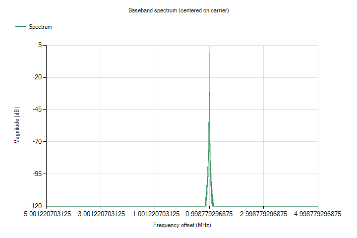

- `ref-multitone-spectrum.png` — 4-tone Newman multitone, 1 MHz spacing — spectrum (app view)

  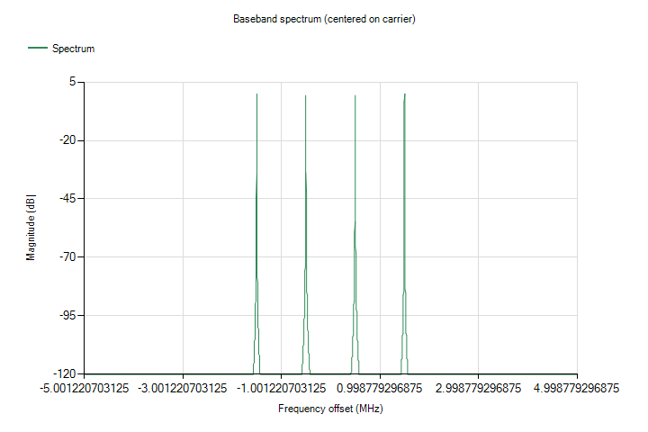

- `ref-multitone-distortion-spectrum.png` — 16-tone comb with an NPR notch — spectrum (app view)

  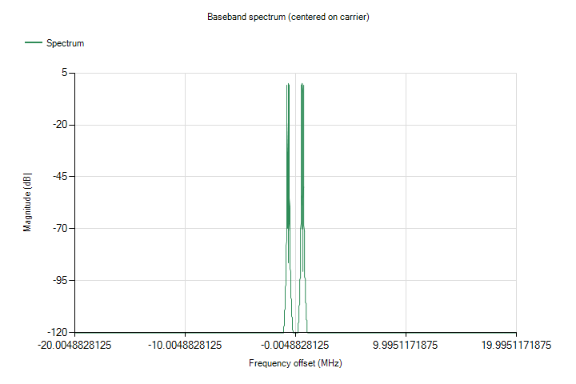

- `ref-multi-carrier-spectrum.png` — 3-carrier composite, 1 MHz spacing — spectrum (app view)

  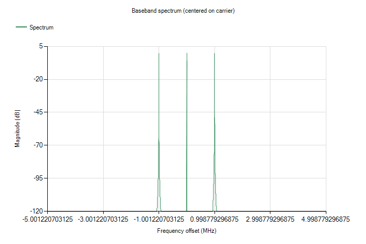

- `ref-custom-mod-spectrum.png` — QAM16, 1 Msym/s, RRC α=0.35 — spectrum (app view)

  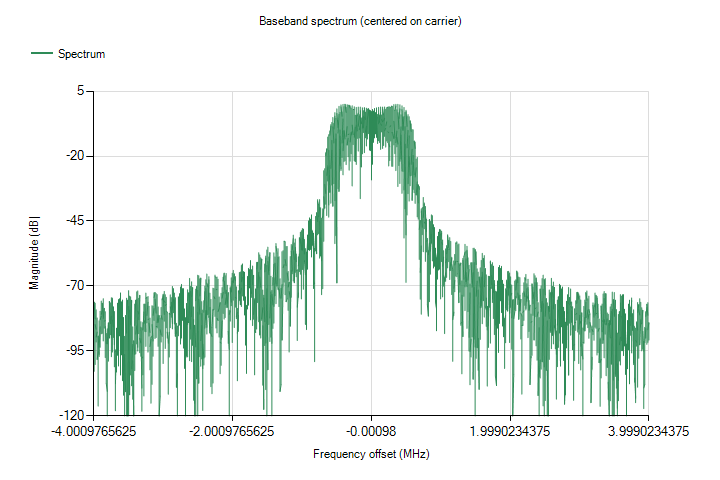

- `ref-pulse-spectrum.png` — 1 µs LFM chirp, 10 µs PRI — spectrum (app view)

  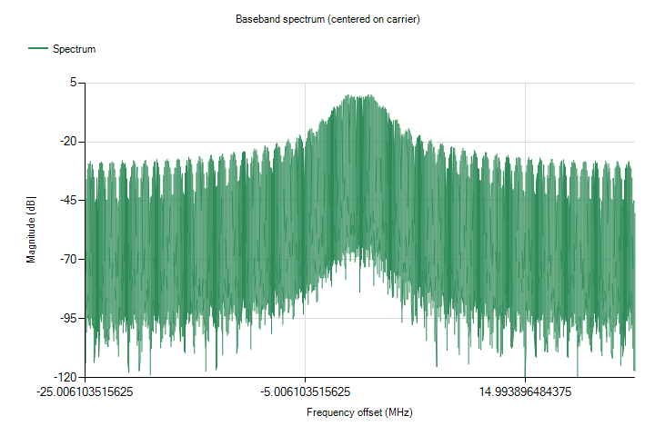

- `ref-jitter-spectrum.png` — 10 MHz clock, sinusoidal SJ 0.2 UIpp — spectrum (app view)

  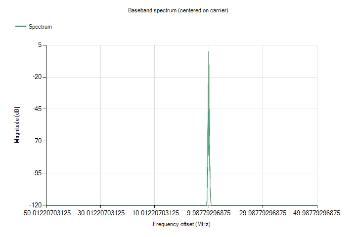

- `ref-gsm-edge-spectrum.png` — EDGE 3π/8 8-PSK (v2) — spectrum (app view)

  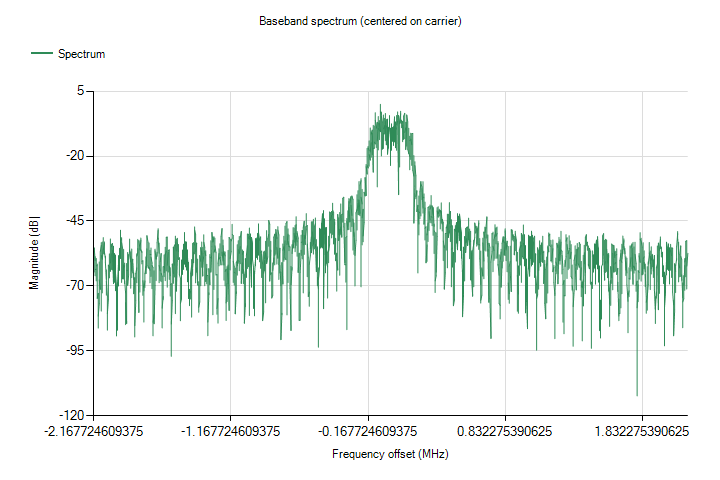

- `ref-bluetooth-spectrum.png` — EDR 8-DPSK 3 Mb/s (v2) — spectrum (app view)

  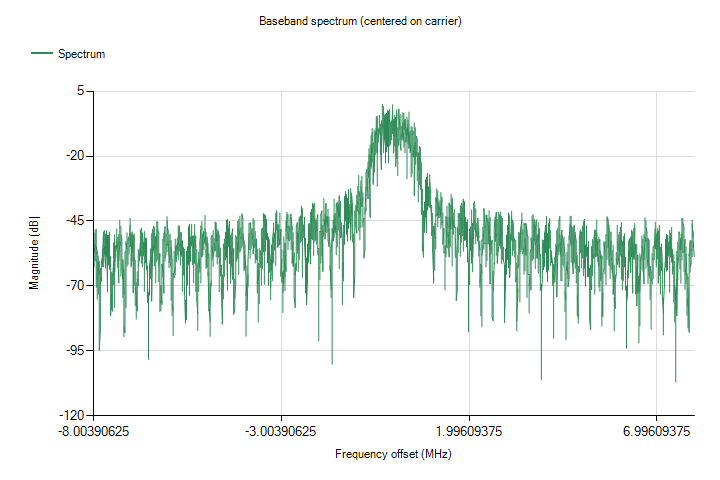

- `ref-wcdma-fdd-spectrum.png` — W-CDMA 4-code multiplex (v2) — spectrum (app view)

  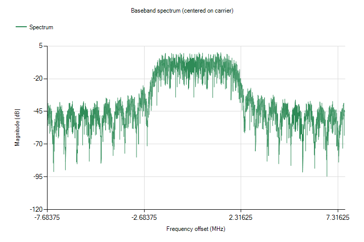

- `ref-wcdma-hspa-spectrum.png` — HSPA QAM16 4-code multiplex (v2) — spectrum (app view)

  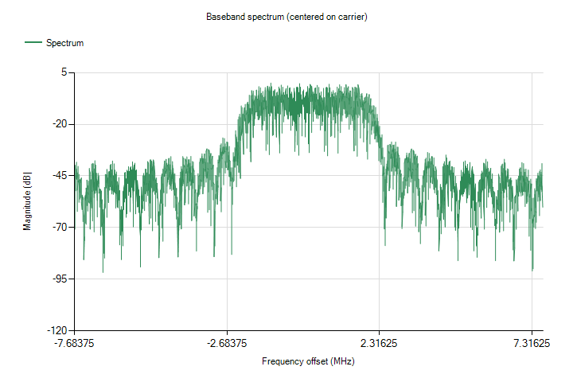

- `ref-cdma2000-spectrum.png` — cdma2000 4-code multiplex (v2) — spectrum (app view)

  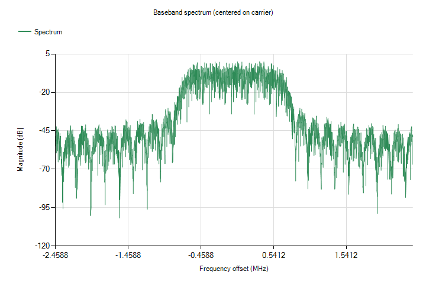

- `ref-td-scdma-spectrum.png` — TD-SCDMA 4-code multiplex (v2) — spectrum (app view)

  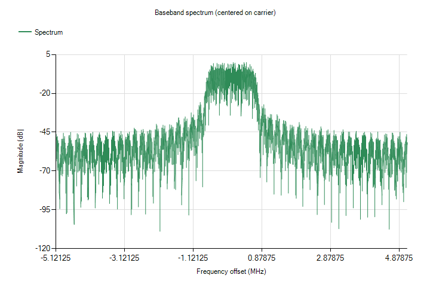

- `ref-lte-fdd-spectrum.png` — LTE FDD 5 MHz E-UTRA frame (v2) — spectrum (app view)

  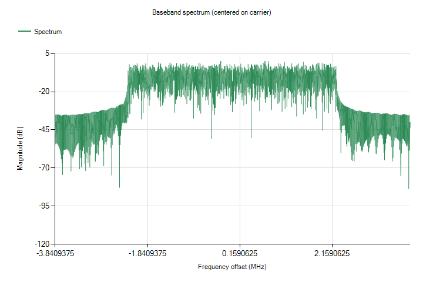

- `ref-lte-tdd-spectrum.png` — LTE TDD 5 MHz frame, config 1 (v2) — spectrum (app view)

  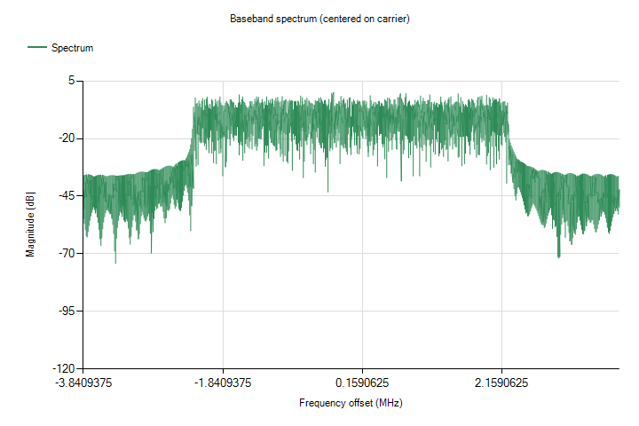

- `ref-wlan-80211-spectrum.png` — 802.11a/g 20 MHz PPDU (v2) — spectrum (app view)

  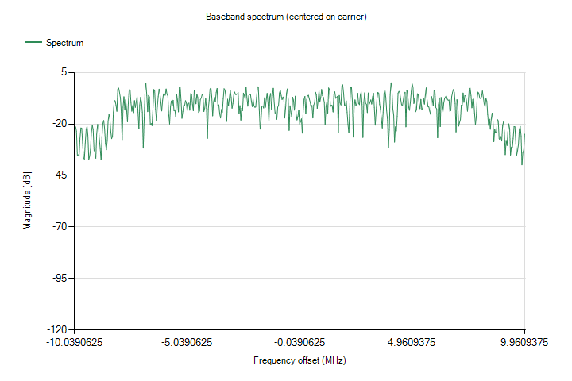

- `ref-wimax-fixed-spectrum.png` — 802.16-2004 3.5 MHz frame (v2) — spectrum (app view)

  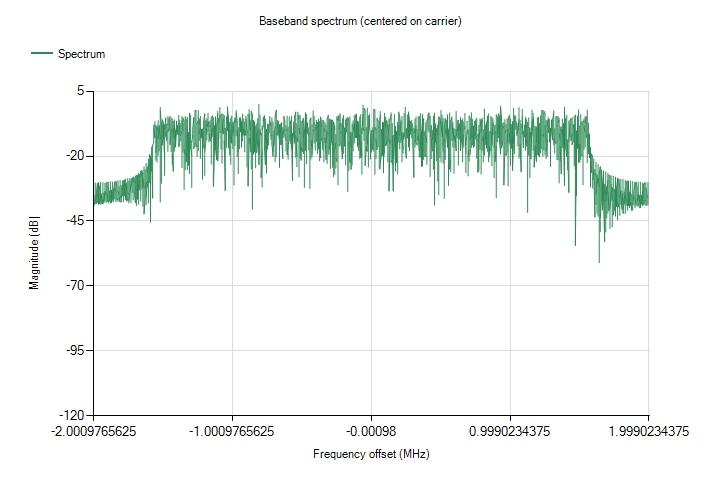

- `ref-wimax-mobile-spectrum.png` — 802.16e 512-FFT OFDMA frame (v2) — spectrum (app view)

  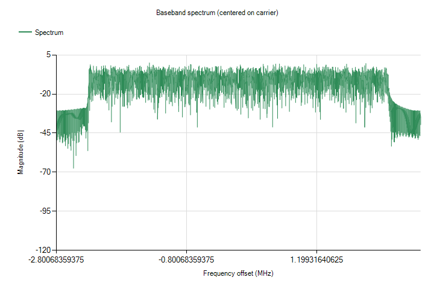

- `ref-t-dmb-spectrum.png` — T-DMB Mode III COFDM frame (v2) — spectrum (app view)

  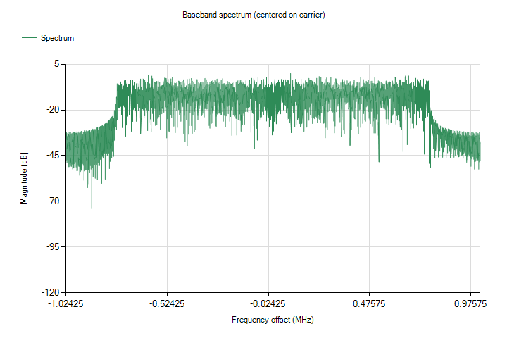

- `ref-digital-video-spectrum.png` — DVB-T 2K COFDM with scattered pilots (v2) — spectrum (app view)

  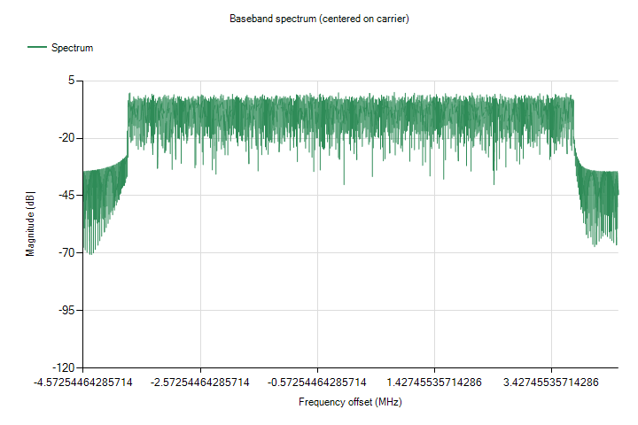

- `ref-broadcast-radio-spectrum.png` — Stereo FM with RDS subcarrier (v2) — spectrum (app view)

  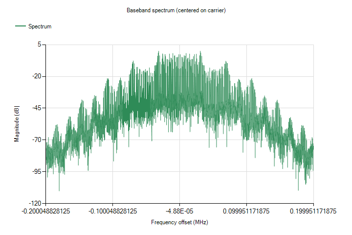

- `ref-awgn-spectrum.png` — Band-limited AWGN, 2 MHz, 10 dB crest — spectrum (app view)

  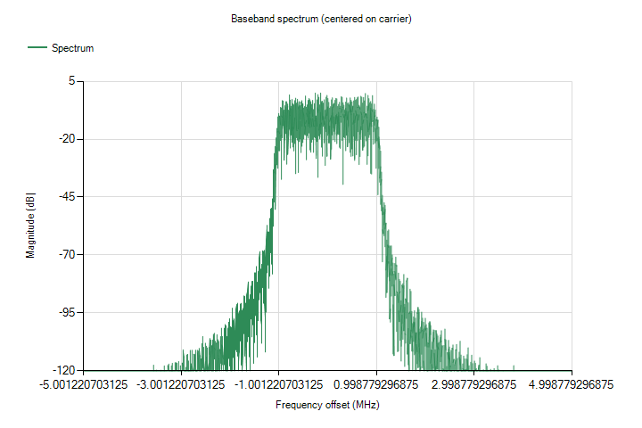

- `ref-import-iq-spectrum.png` — CW round-tripped through an I/Q CSV import — spectrum (app view)

  

