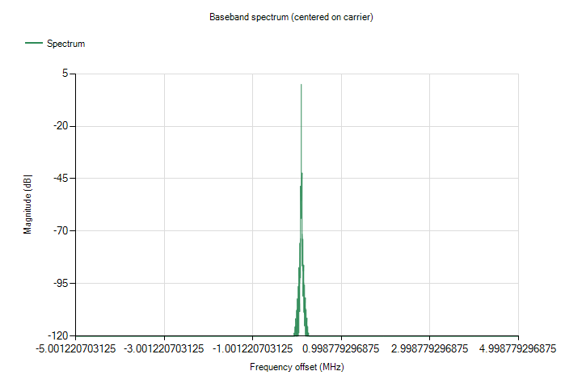
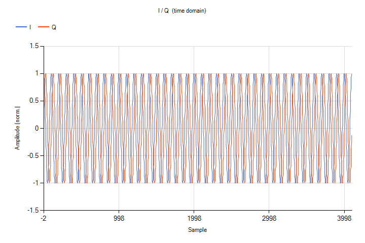
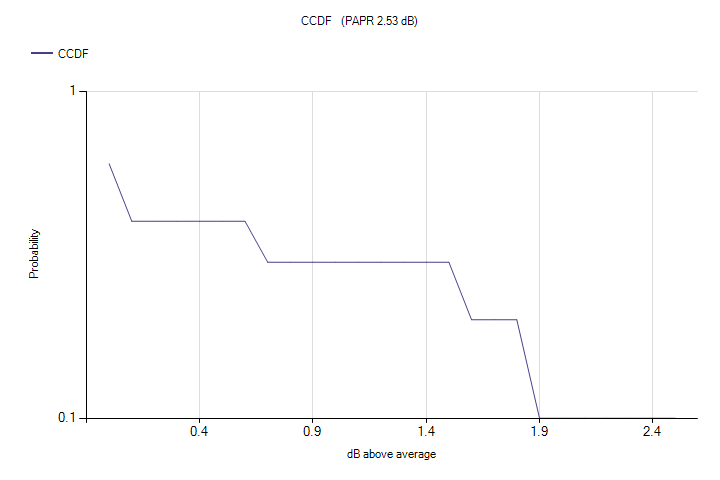
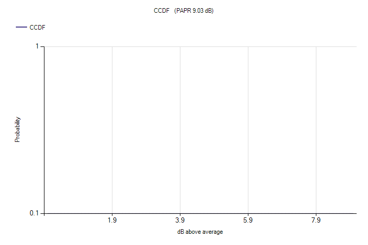
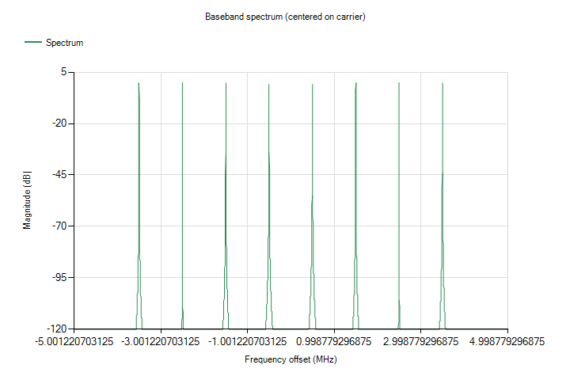
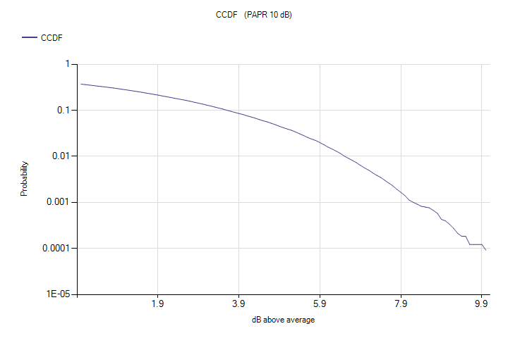
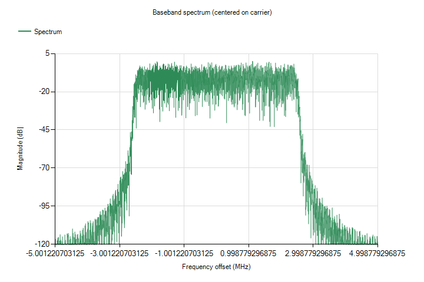
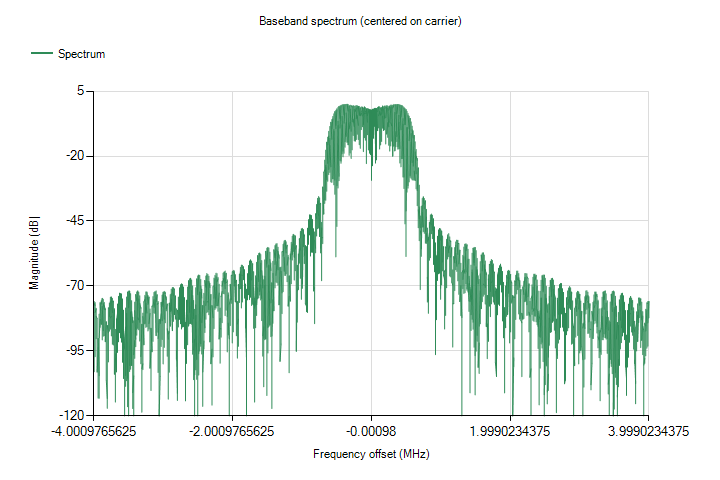
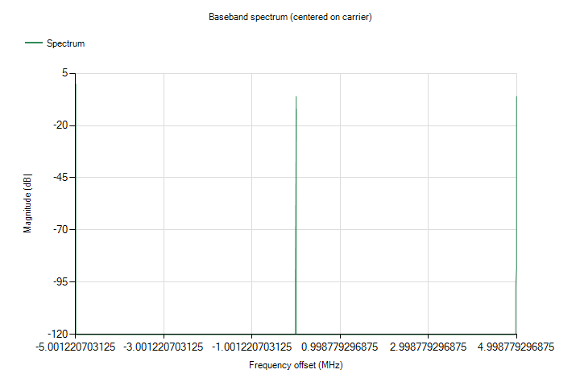
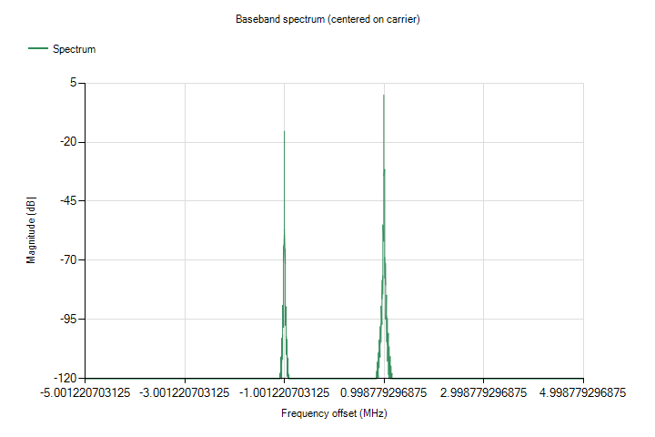

# Tutorial images (auto-generated)

Regenerated by `ESG-SignalCreator.exe --tutorial-images docs/images/tutorials` (issue #150).
**Do not edit by hand** — update the tutorial-image harness and re-run instead.

## Tutorial 1

- `t01-cw-spectrum.png` — CW tone at +100 kHz — spectrum

  

- `t01-cw-iq.png` — CW tone — I/Q vs time

  

## Tutorial 3

- `t03-multitone-newman-ccdf.png` — 8-tone Newman multitone — CCDF (low PAPR)

  

- `t03-multitone-equal-ccdf.png` — 8-tone Equal-phased multitone — CCDF (high PAPR)

  

- `t03-multitone-spectrum.png` — 8-tone multitone — spectrum

  

## Tutorial 4

- `t04-awgn-ccdf.png` — Band-limited AWGN — CCDF (~10 dB crest)

  

- `t04-awgn-spectrum.png` — Band-limited AWGN — spectrum

  

## Tutorial 5

- `t05-qpsk-constellation.png` — QPSK — constellation

  

- `t05-qpsk-eye.png` — QPSK — eye diagram

  

- `t05-qpsk-spectrum.png` — QPSK RRC α=0.35 — spectrum

  

## Tutorial 6

- `t06-multicarrier-spectrum.png` — 3-carrier composite — spectrum

  

## Tutorial 8

- `t08-iq-clean-spectrum.png` — Clean tone at +1 MHz — spectrum (baseline)

  

- `t08-iq-imbalance-spectrum.png` — 3 dB I/Q gain imbalance — image tone at −1 MHz

  

